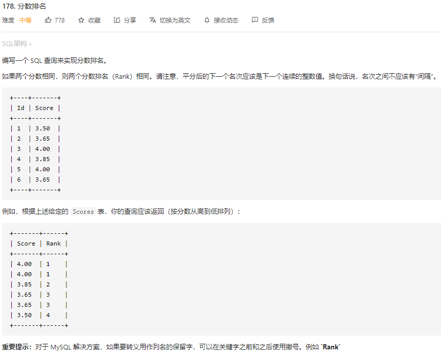
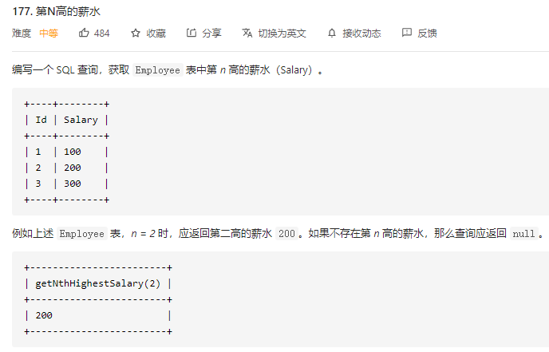

#### [分数排名](https://leetcode-cn.com/problems/rank-scores/)

​	

* 四大排名函数

  * row_number()：依次递增排名，无重复排名，1，2，3，4，5，6
  * rank()：相同分数归为一组排名相同，但是重复后下一个人按照实际排名，排名不连续，1，1，3，4，4，6
  * dense_rank()：排名连续，分数一致排名一致，分数不一致排名 + 1，1，1，2，3，3，4
  * NTILE(4)：将所有记录分成group_num个组，组内序号一样，排名按组递增，1，1，1，2，2，3，3(3组)
  * 语句

  ```mysql
  select Score, dense_rank() OVER(order by Score desc) as `Rank` from Scores; 
  ```

* 嵌套查询：包含两个部分，第一部分是降序排列的分数，第二部分是每个分数对应的排名

  * 第一部分

    ```mysql
    select a.Score as Score from Scores a order by a.Score DESC -- Score降序排序
    ```

  * 第二部分，查询每个分数前去重后的个数

    ```mysql
    select count(distinct b.Score) from Scores b where b.Score >= X as `Rank`;
    ```

  * 合并

    ```mysql
    select a.Score as Score,
    (select count(distinct b.Score) from Scores b where b.Score >= a.Score) as `Rank`
    from Scores a
    order by a.Score DESC;
    ```

#### [第N高的薪水](https://leetcode-cn.com/problems/nth-highest-salary/)



* 解法一：group by去重，limit中不能进行计算

  ```mysql
  CREATE FUNCTION getNthHighestSalary(N INT) RETURNS INT
  BEGIN
      set N := N-1;
    -- declare m int;
    -- set m = N-1;
    RETURN (
      select Salary from Employee group by salary order by Salary desc limit N, 1 
      #select IFNULL((select distinct Salary from Employee order by Salary DESC limit N, 1), NULL)
    );
  END
  ```

* 解法二：子查询

  * 排名第N的薪水意味着该表中存在N-1个比其更高的薪水
  * 注意这里的N-1个更高的薪水是指去重后的N-1个，实际对应人数可能不止N-1个
  * 最后返回的薪水也应该去重，因为可能不止一个薪水排名第N
  * 由于对于每个薪水的where条件都要执行一遍子查询，注定其效率低下

  ```mysql
  CREATE FUNCTION getNthHighestSalary(N INT) RETURNS INT
  BEGIN
    RETURN (
        SELECT 
            DISTINCT e.salary
        FROM 
            employee e
        WHERE 
            (SELECT count(DISTINCT salary) FROM employee WHERE salary>e.salary) = N-1
    );
  END
  ```

* 解法三：排序函数(dense_rank)

  ```mysql
  CREATE FUNCTION getNthHighestSalary(N INT) RETURNS INT
  BEGIN
    RETURN (
          SELECT 
              DISTINCT salary
          FROM 
              (SELECT salary, dense_rank() over(ORDER BY salary DESC) AS rnk
               FROM employee) tmp
          WHERE rnk = N
    );
  END
  ```

  