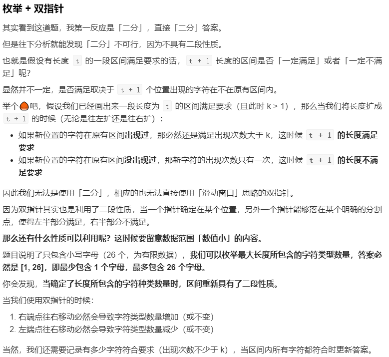
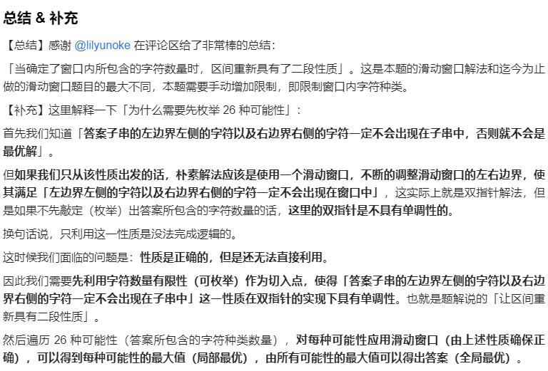
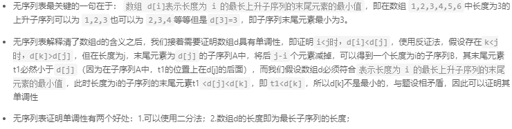
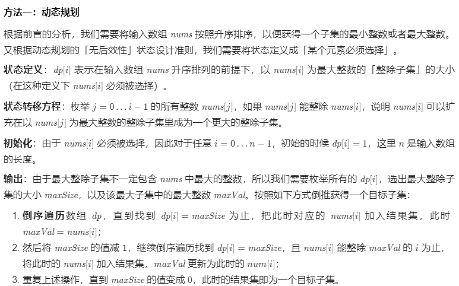
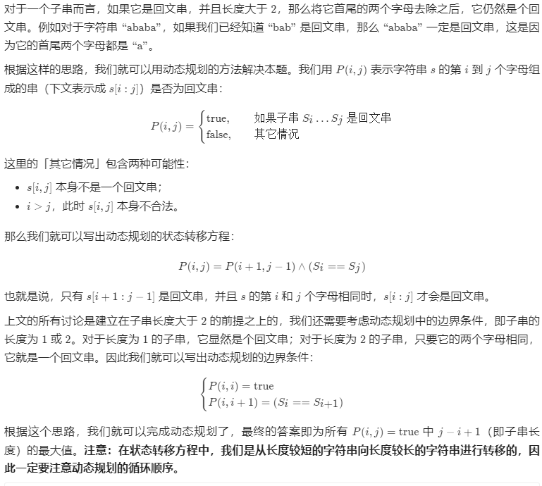
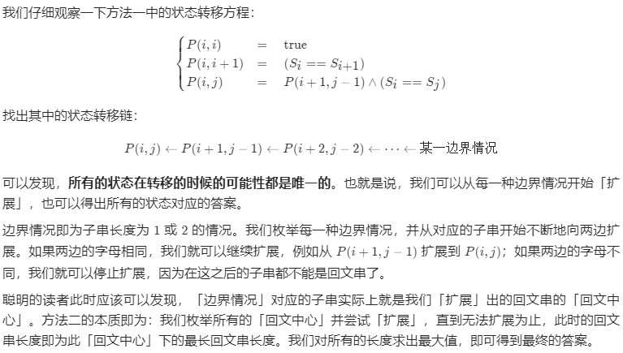
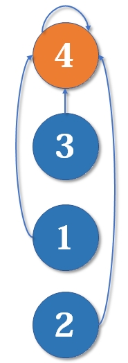

# 基本排序算法

## 总结

| 排序算法 |      平均时间复杂度       |         最好情况          |         最坏情况          |       空间复杂度       | 排序方式  | 稳定性 |
| :------: | :-----------------------: | :-----------------------: | :-----------------------: | :--------------------: | :-------: | :----: |
| 冒泡排序 |    $ \textbf{O}(n^2) $    |     $ \textbf{O}(n) $     |    $ \textbf{O}(n^2) $    |   $ \textbf{O}(1) $    | In-place  |  稳定  |
| 选择排序 |    $ \textbf{O}(n^2) $    |    $ \textbf{O}(n^2) $    |    $ \textbf{O}(n^2) $    |   $ \textbf{O}(1) $    | In-place  | 不稳定 |
| 插入排序 |  $ \textbf{O}(n^{1.3}) $  |     $ \textbf{O}(n) $     |    $ \textbf{O}(n^2) $    |   $ \textbf{O}(1) $    | In-place  |  稳定  |
| 希尔排序 |  $ \textbf{O}(n\log n) $  |  $ \textbf{O}(n\log n) $  |    $ \textbf{O}(n^2) $    |   $ \textbf{O}(1) $    | In-place  | 不稳定 |
| 归并排序 |  $ \textbf{O}(n\log n) $  |  $ \textbf{O}(n\log n) $  |  $ \textbf{O}(n\log n) $  |   $ \textbf{O}(n) $    | Out-place |  稳定  |
| 快速排序 |  $ \textbf{O}(n\log n) $  |  $ \textbf{O}(n\log n) $  |  $ \textbf{O}(n\log n) $  | $ \textbf{O}(\log n) $ | In-place  | 不稳定 |
|  堆排序  |  $ \textbf{O}(n\log n) $  |  $ \textbf{O}(n\log n) $  |  $ \textbf{O}(n\log n) $  |   $ \textbf{O}(1) $    | In-place  | 不稳定 |
|          |                           |                           |                           |                        |           |        |
| 计数排序 |    $ \textbf{O}(n+k) $    |    $ \textbf{O}(n+k) $    |    $ \textbf{O}(n+k) $    |  $ \textbf{O}(n+k) $   | Out-place |  稳定  |
|  桶排序  |    $ \textbf{O}(n+k) $    |     $ \textbf{O}(n) $     |    $ \textbf{O}(n^2) $    |  $ \textbf{O}(n+k) $   | Out-place |  稳定  |
| 基数排序 | $ \textbf{O}(n\times k) $ | $ \textbf{O}(n\times k) $ | $ \textbf{O}(n\times k) $ |  $ \textbf{O}(n+k) $   | Out-place |  稳定  |

* 平均时间复杂度同样是$ \textbf{O}(n\log n) $，为什么快速排序要比堆排序性能好？
  * 堆排序访问数据的方式没有快速排序友好
    * **对于快速排序来说，数据是顺序访问的。而对于堆排序来说，数据是跳着访问的。**比如，堆排序中，最重要的一个操作就是数据的堆化。比如下面这个例子，对堆顶进行堆化，会依次访问数组下标是1，2，4，8的元素，而不像快速排序那样，局部顺序访问，所以，**这样对CPU缓存是不友好的**
  * 对于同样的数据，在排序过程中，堆排序算法的数据交换次数要多于快速排序
    * 对于基于比较的排序算法来说，整个排序过程是由两个基本操作组成的，比较和交换。**快速排序交换的次数不会比逆序的多。但是堆排序的第一步是建堆，建堆的过程会打乱数据原有的相对选择顺序，导致数据有序度降低。比如对于一组已经有序的数据来说，经过建堆之后，数据反而变得更无序了**

## 冒泡排序

```c++
// 基本冒泡排序
void bubbleSort(int array[], int length)
{
	for (int i = 0; i < length - 1; i++)
	{
		for (int j = 0; j < length - 1 - i; j++)
		{
			if (array[j] > array[j + 1])
			{
				swap(array[j], array[j + 1]);
			}
		}
	}
}

// 改进版冒泡排序
void improvedBubbleSort(int array[], int length)
{
	bool flag = true;
	for (int i = 0; i < length - 1 && flag == true; i++)
	{
		flag = false;
		for (int j = 0; j < length - 1 - i; j++)
		{
			if (array[j] > array[j + 1])
			{
				flag = true;
				swap(array[j], array[j + 1]);
			}
		}
	}
}
```

## 选择排序

```C++
// 选择排序
void selectionSort(int array[], int length)
{
	for (int i = 0; i < length - 1; i++)
	{
		int minIdx = i;
		for (int j = i + 1; j < length; j++)
		{
			if (array[j] < array[minIdx])
			{
				minIdx = j;
			}
		}
		if (minIdx != i)
		{
			swap(array[i], array[minIdx]);
		}
	}
}
```

##　插入排序

* 最佳情况在 排序数组有序 时发生

```C++
// 插入排序
void insertionSort(int array[], int length)
{
	for (int i = 1; i < length; i++)
	{
		int j = i - 1;
		int tmp = array[i];
		while (j >= 0 && array[j] > tmp)
		{
			array[j + 1] = array[j];
			j--;
		}
		array[j + 1] = tmp;
	}
}

// 二分插入排序
void binaryInsertionSort(int array[], int length)
{
	for (int i = 1; i < length; i++)
	{
		int tmp = array[i];
		int low = 0, high = i - 1;
		while (low <= high)
		{
			int mid = low + (high - low) / 2;
			if (array[mid] > tmp)
				high = mid - 1;
			else
				low = mid + 1;
		}
		for (int j = i; j >= high + 2; j--)
		{
			array[j] = array[j - 1];
		}
		array[high + 1] = tmp;
	}
}
```

## 希尔排序

```c++
// 希尔排序
void shellSort(int array[], int length)
{
	std::vector<int> gaps;
	int h = 1;
	while (h < length)
	{
		gaps.push_back(h);
		h = 3 * h + 1;
	}
	int numGap = gaps.size()-1;
	for (; numGap >= 0; numGap--)
	{
		int gap = gaps[numGap];
		for (int i = gap; i < length; i += gap)
		{
			shellInsert(array, gap, i);
		}
	}
}
// 插入操作
void shellInsert(int array[], int gap, int idx)
{
	int tmp = array[idx];
	int j = idx - gap;
	while (j >= 0 && array[j] > tmp)
	{
		array[j + gap] = array[j];
		j -= gap;
	}
	array[j + gap] = tmp;
}
```

## 归并排序

```c++
// 归并排序
void mergeSort(int array[], int length)
{
	//mergeSort_recursive(array, 0, length - 1);	// 递归版本
	mergeSort_iterative(array, length);  	// 迭代版本
}

// 迭代版本，自底向上
void mergeSortIterative(int array[], int length)
{
	int stride = 2;
	while (stride < length)
	{
		int start = 0;
		while (start + stride < length)
		{
			merge(array, start, start + stride - 1);
			start += stride;
		}
		merge(array, start, length-1);  // 末尾元素
		stride *= 2;
	}
	merge(array, 0, length - 1);
}

// 递归版本，自顶向下
void mergeSortRecursive(int array[], int first, int last)
{
	if (first < last)
	{
		int mid = first +　(last－first) / 2;
		mergeSortRecursive(array, first, mid);
		mergeSortRecursive(array, mid + 1, last);
		merge(array, first, last);
	}
}

void merge(int array[], int first, int last)
{
    if(first < last)
    {
        int left = first, mid = first + (last - first) / 2, right = mid + 1, idx = 0;
        int* tmp = new int[static_cast<size_t>(last-left)+1];
        while (left<=mid||right<=last)
        {
            if (left <= mid && right <= last)
            {
                if (array[left] <= array[right])
                    tmp[idx++] = array[left++];
                else
                    tmp[idx++] = array[right++];
            }
            else if (left <= mid)
                tmp[idx++] = array[left++];
            else
                tmp[idx++] = array[right++];
        }
        idx = 0;
        while (first <= last)
            array[first++] = tmp[idx++];
        delete[] tmp;
    }
}
```

## 快速排序

* 最坏情况：每次划分只能将序列分为一个元素与其他元素两部分(正序，逆序，元素全部相等)，这时的快速排序退化为冒泡排序
* 最好情况：Partition函数每次恰好能均分序列
* 与枢轴（pivot）的选择策略有关

```c++
// 递归版本快排
// 
void quickSortRecurcive(int array[], int low, int high)
{
	if (low < high)
	{
		int pivotIdx = partition(array, low, high);
		quickSortRecurcive(array, low, pivotIdx-1);
		quickSortRecurcive(array, pivotIdx+1, high);
	}
}

// 迭代版本
void quickSortIterative(int array[], int length)
{
    std::stack< std::pair<int,int> > range;
    int left, right, mid;
    if(length > 1)
    {
        left = 0;
        right = length - 1;
    	mid = partition(array, left, right);
        if(left < mid-1)
            range.push({left, mid-1});
        if(mid+1 < right)
            range.push({mid+1, right});
    }
    while(!range.empty())
    {
        auto subRange = range.top();
        range.pop();
        left = subRange.first;
        right = subRange.second;
        mid = partition(array, left, right);
        if(left < mid-1)
            range.push({left, mid-1});
        if(mid + 1 < right)
            range.push({mid+1, right});
    }
}

int partition(int array[], int low, int high)
{
	// swap(array[low], array[(low + high) / 2]);   // 选中间元素作为枢轴
    // int pivot = array[low];		// 选第一个元素作为枢轴
    
	// 三数取中（median-of-three）
    int pivot = selectPivotMedianOfThree(array, low, high);
	while (low < high)
	{
		while (low < high && array[high] >= pivot)
			high--;
		array[low] = array[high];
		while (low < high && array[low] <= pivot)
			low++;
		array[high] = array[low];
	}
	array[low] = pivot;
	return low;
}


// 函数作用：取待排序序列中low、mid、high三个位置上数据，选取他们中间的那个数据作为枢轴
int selectPivotMedianOfThree(int arr[],int low,int high)
{
	int mid = low + ((high - low) >> 1);// 计算数组中间的元素的下标
	//使用三数取中法选择枢轴
 
	if (arr[mid] > arr[high]) // 目标: arr[mid] <= arr[high]
	{
		swap(arr[mid],arr[high]);
	}
 
	if (arr[low] > arr[high])//目标: arr[low] <= arr[high]
	{
		swap(arr[low],arr[high]);
	}
 
	if (arr[mid] > arr[low]) // 目标: arr[low] >= arr[mid]
	{
		swap(arr[mid],arr[low]);
	}
 
	//此时，arr[mid] <= arr[low] <= arr[high]
	return arr[low];
	// low的位置上保存这三个位置中间的值
	// 分割时可以直接使用low位置的元素作为枢轴，而不用改变分割函数了
}
```

## 堆排序

```C++
void heapSort(int array[], int length)
{
	buildHeap(array, length);
	for (int i = length - 1; i > 0; i--)
	{
		swap(array[0], array[i]);   // 将最大值移动到最后，然后调整堆
		adjustHeap(array, 0, i - 1);
	}
}

void buildHeap(int array[], int length)
{
	for (int i = length / 2; i >= 0; i--)  // 自底向上
		adjustHeap(array, i, length - 1);
}

// 下沉法(sink)
void adjustHeap(int array[], int root, int last)
{
	int larger = 2 * root + 1;  // 左子节点
	while (larger <= last)  // 至少一个孩子
	{
		if (larger < last && array[larger] < array[larger + 1])  // have two children, and the right 
			larger++;											// child is larger than the left, 
		if (array[root] < array[larger])						//"larger" points to the right child
		{
			swap(array[root], array[larger]);
			root = larger;
			larger = 2 * root + 1;   // go to next level
		}
		else
			break;   //satisfy the heap property, exit
	}
}
```

## 计数排序

```c++
// 计数排序
void countSort(int arr[], int length)
{
    int minVal = INT_MAX, maxVal = INT_MIN;
    for(int i = 0; i < length; i++)
    {
        if(arr[i] > maxVal)
        	maxVal = array[i];
        if(arr[i] < minVal)
            minVal = arr[i];
    }
    int bias = 0 - minVal;
    int * count = new int[maxVal - minVal + 1];
    memset(count, 0, maxVal-minVal+1);
    for(int i = 0; i < length; i++)
    {
        count[arr[i] + bias]++;
    }
    
    for(int i = 1; i < maxVal-minVal+1; i++)
    {
        count[i] += count[i-1];
    }
    
    int * result = new int[length];
    int idx = length-1;
    while(idx>=0)
    {
        count[array[idx] + bias]--;
        result[count[arr[idx] + bias] - 1] = arr[idx];
        idx--;
    }
    for(int i = 0; i<length;i++)
        arr[i] = result[i];
    
    delete count;
    delete result;
}
```

## 桶排序

```c++
void bucketSort(int array[], int length)
{
    int maxVal = INT_MIN;
    int minVal = INT_MAX;
    for(int i = 0; i < length; i++)
    {
        maxVal = max(maxVal, array[i]);
        minVal = min(minVal, array[i]);
    }
    int bucketCount = (maxVal - minVal)/lenght + 1;
    std::vector<int> *bucketArr = new std::vector<int>[bucketCount];
    for(int i = 0; i < length; i++)
    {
        int num = (array[i] - minVal) / length;
        bucketArr[num].push_back(array[i]);
    }
    for(int i = 0; i < bucketCount; i++)
    {
        std::sort(bucketArr[i].begin(), bucketArr[i].end());
    }
    int idx = 0;
    for(int i = 0; i < bucketCount; i++)
    {
        for(int j = 0; j < bucketArr[i].size(); j++)
            array[idx++] = bucketArr[i][j];
    }
    delete [] bucketArr;
}
```

# 哈希

* 概念

  * 散列的概念属于查找，它**不以关键字的比较为基本操作**，采用直接寻址技术。在理想情况下，查找的期望时间为O(1)
  * hash函数就是把任意长的输入字符串变化成固定长的输出字符串的一种函数。输出字符串的长度称为hash函数的位数
  * 散列（Hashing）通过散列函数将要检索的项与索引（散列，散列值）关联起来，生成一种便于搜索的数据结构（散列表）

* 常用哈希构造函数

  * 直接定址法
    * 取关键字或关键字的某个线性函数值为哈希地址：H(key) = key 或 H(key) = a·key + b，其中a和b为常数，这种哈希函数叫做自身函数
    * 注意：由于直接定址所得地址集合和关键字集合的大小相同。因此，**对于不同的关键字不会发生冲突**。但实际中能使用这种哈希函数的情况很少
  * 相乘取整法
    * 首先用关键字key乘上某个常数A(0 < A < 1)，并抽取出key*A的小数部分；然后用m乘以该小数后取整
    * 注意：该方法最大的优点是m的选取比除余法要求更低。比如，完全可选择它是2的整数次幂。虽然该方法对任何A的值都适用，但对某些值效果会更好。Knuth建议选取 0.61803……
  * 平方取中法
    * 取关键字平方后的中间几位为哈希地址
    * 通过平方扩大差别，另外中间几位与乘数的每一位相关，由此产生的散列地址较为均匀。这是一种较常用的构造哈希函数的方法
    * 将一组关键字(0100，0110，1010，1001，0111)，平方后得(0010000，0012100，1020100，1002001，0012321)，若取表长为1000，则可取中间的三位数作为散列地址集：(100，121，201，020，123)
  * 除留余数法
    * 取关键字被数p除后所得余数为哈希地址：H(key) = key MOD p (p ≤ m)
    * 注意：这是一种最简单，也最常用的构造哈希函数的方法。它**不仅可以对关键字直接取模(MOD)，也可在折迭、平方取中等运算之后取模**。值得注意的是，在使用除留余数法时，**对p的选择很重要**。一般情况下可以**选p为质数或不包含小于20的质因素的合数**
  * 随机数法
    * 选择一个随机函数，取关键字的随机函数值为它的哈希地址，即 `H(key) = random (key)`，其中random为随机函数。通常，当关键字长度不等时采用此法构造哈希函数较恰当

* 解决哈希冲突的方法

  * 开放定址法：
    * 就是在发生冲突后，通过某种探测技术，去依次探查其他单元，直到探查到不冲突为止，将元素添加进去
    * 假如是在index的位置发生哈希冲突，那么通常有一下几种探测方式
      * 线性探测法（线性探测再散列）：向后依次探测index+1，index+2…位置，看是否冲突，直到不冲突为止，将元素添加进去。
      * 平方探测法：不探测index的后一个位置，而是探测$2^i$位置上时发生冲突，比如探测$2^0$位置上的冲突，接着探测$2^1$位置，依此类推，直至冲突解决
  * 链地址法
    * 链表法就是在发生冲突的地址处，挂一个单向链表，然后所有在该位置冲突的数据，都插入这个链表中。插入数据的方式有多种，可以从链表的尾部向头部依次插入数据，也可以从头部向尾部依次插入数据，也可以依据某种规则在链表的中间插入数据，总之保证链表中的数据的有序性。Java的HashMap类就是采取链表法的处理方案
  * 再哈希法
    * 在发生哈希冲突后，使用另外一个哈希算法产生一个新的地址，直到不发生冲突为止。这个应该很好理解
    * 再哈希法可以有效的避免堆积现象，但是缺点是不能增加了计算时间和哈希算法的数量，而且不能保证在哈希表未满的情况下，总能找到不冲突的地址
  * 建立一个公共溢出区
    * 建立一个基本表，**基本表的大小等于哈希表的大小**。**建立一个溢出表，所有哈希地址的第一个记录都存在基本表中，所有发生冲突的数据，不管哈希算法得到的地址是什么，都放入溢出表中**
    * 但是有一个缺点就是，必须事**先知道哈希表的可能大小，而且溢出表里的数据不能太多，否则影响溢出表的查询效率**。实际上就是要尽量减少冲突

* MD5加密算法

  * MD5是一个安全的散列算法，**输入两个不同的明文不会得到相同的输出值，根据输出值，不能得到原始的明文，即其过程不可逆**；所以要解密MD5没有现成的算法，只能用**穷举法**，把可能出现的明文，用MD5算法散列之后，**把得到的散列值和原始的数据形成一个一对一的映射表**，通过比在表中比破解密码的MD5算法散列值，通过匹配从映射表中找出破解密码所对应的原始明文

* 一致性哈希

  * [详见1](https://blog.csdn.net/cywosp/article/details/23397179/)

  * [详见2](https://www.jianshu.com/p/49e3fbf41b9b)

  * 概念

    * 一致性Hash是一种特殊的Hash算法，由于其均衡性、持久性的映射特点，被广泛的应用于**负载均衡领域和分布式存储**，如nginx和memcached都采用了一致性Hash来作为集群负载均衡的方案
    * 普通的Hash函数最大的作用是散列，或者说是将一系列在形式上具有相似性质的数据，打散成随机的、均匀分布的数据。**不难发现，这样的Hash只要集群的数量N发生变化，之前的所有Hash映射就会全部失效**。如果集群中的每个机器提供的服务没有差别，倒不会产生什么影响，但对于分布式缓存这样的系统而言，**映射全部失效就意味着之前的缓存全部失效，后果将会是灾难性的**。一致性Hash通过构建**环状的Hash空间代替线性Hash空间**的方法解决了这个问题

  * 良好的分布式cahce系统中的一致性hash算法应该满足以下几个方面

    * **平衡性(Balance)**：平衡性是指哈希的结果能够**尽可能分布到所有的缓冲中去**，这样可以使得所有的缓冲空间都得到利用。很多哈希算法都能够满足这一条件
    * **单调性(Monotonicity)**：单调性是指如果**已经有一些内容通过哈希分派到了相应的缓冲中**，又有**新的缓冲区加入到系统中，那么哈希的结果应能够保证原有已分配的内容可以被映射到新的缓冲区中去，而不会被映射到旧的缓冲集合中的其他缓冲区**
    * **分散性(Spread)**：在分布式环境中，终端有可能看不到所有的缓冲，而是只能看到其中的一部分。**当终端希望通过哈希过程将内容映射到缓冲上时，由于不同终端所见的缓冲范围有可能不同，从而导致哈希的结果不一致，最终的结果是相同的内容被不同的终端映射到不同的缓冲区中**。这种情况显然是应该避免的，**因为它导致相同内容被存储到不同缓冲中去，降低了系统存储的效率**。分散性的定义就是上述情况发生的严重程度。好的哈希算法应能够尽量避免不一致的情况发生，也就是尽量降低分散性
    * **负载(Load)**：负载问题实际上是从另一个角度看待分散性问题。**既然不同的终端可能将相同的内容映射到不同的缓冲区中，那么对于一个特定的缓冲区而言，也可能被不同的用户映射为不同的内容**。与分散性一样，这种情况也是应当避免的，因此好的哈希算法应能够尽量**降低缓冲的负荷**
    * **平滑性(Smoothness)**：平滑性是指缓存服务器的数目平滑改变和缓存对象的平滑改变是一致的

  * **原理**

    * 一致性哈希将整个哈希值空间组织成一个虚拟的圆环，如假设某哈希函数$H$的值空间为$0 \sim 2^{32}-1$（即哈希值是一个32位无符号整形），整个哈希空间环如下：整个空间按顺时针方向组织，0和$2^{32}-1$在零点中方向重合

      

    * 下一步**将各个服务器使用Hash进行一次哈希**，具体可以选择服务器的**ip或主机名作为关键字**进行哈希，这样每台机器就能确定其在哈希环上的位置，这里假设将上文中四台服务器使用ip地址哈希后在环空间的位置如下

      

      接下来使用如下算法定位数据访问到相应服务器：**将数据key使用相同的函数Hash计算出哈希值，并确定此数据在环上的位置，从此位置沿环顺时针“行走”，第一台遇到的服务器就是其应该定位到的服务器**

    * 例如我们有Object A、Object B、Object C、Object D四个数据对象，经过哈希计算后，在环空间上的位置如下。根据一致性哈希算法，数据A会被定为到Node A上，B被定为到Node B上，C被定为到Node C上，D被定为到Node D上

      

  * **一致性哈希算法的容错性和可扩展性**

    * 现假设Node C不幸宕机，可以看到此时对象A、B、D不会受到影响，**只有C对象被重定位到Node D**。一般的，在一致性哈希算法中，**如果一台服务器不可用，则受影响的数据仅仅是此服务器到其环空间中后一台服务器（即沿着顺时针方向行走遇到的第一台服务器）之间数据，其它不会受到影响**

    * 如果在系统中增加一台服务器Node X，如下图所示

      

      此时对象Object A、B、D不受影响，只有对象C需要重定位到新的Node X 。一般的，在一致性哈希算法中，**如果增加一台服务器，则受影响的数据仅仅是新服务器到其环空间中前一台服务器（即沿着逆时针方向行走遇到的第一台服务器）之间数据，其它数据也不会受到影响**

# 红黑树

* 定义及性质

  * 一般的，红黑树，满足以下性质，即只有满足以下全部性质的树，我们才称之为红黑树：
    * 每个结点要么是红的，要么是黑的
    * 根结点是黑的
    * 每个叶结点（叶结点即指树尾端NIL指针或NULL结点）是黑的
    * 如果一个结点是红的，那么它的俩个儿子都是黑的
    * 对于任一结点而言，其到叶结点树尾端NIL指针的每一条路径都包含相同数目的黑结点

* **红黑树的各种操作的时间复杂度都是$\textbf{O}(\log n)$**

* **红黑树相比于BST和AVL树有什么优点？**

  * 红黑树是**牺牲了严格的高度平衡的优越条件**为代价，它只要求部分地达到平衡要求，降低了对旋转的要求，从而提高了性能。红黑树能够以$\textbf{O}(\log n)$的时间复杂度进行搜索、插入、删除操作。此外，**由于它的设计，任何不平衡都会在三次旋转之内解决**。当然，还有一些更好的，但实现起来更复杂的数据结构能够做到一步旋转之内达到平衡，但红黑树能够给我们一个比较“便宜”的解决方案
  * 相比于BST，因为**红黑树可以能确保树的最长路径不大于两倍的最短路径的长度**，所以可以看出它的查找效果是有最低保证的。在最坏的情况下也可以保证$\textbf{O}(\log n)$的，这是要好于二叉查找树的。因为二叉查找树最坏情况可以让查找达到$\textbf{O}(n)$
  * 红黑树的算法时间复杂度和AVL相同，但统计性能比AVL树更高，所以在插入和删除中所做的后期维护操作肯定会比红黑树要耗时好多，但是他们的查找效率都是$\textbf{O}(\log n)$，所以红黑树应用还是高于AVL树的。**实际上插入 AVL 树和红黑树的速度取决于你所插入的数据。如果你的数据分布较好，则比较宜于采用 AVL树(例如随机产生系列数)，但是如果你想处理比较杂乱的情况，则红黑树是比较快的**

* **红黑树相对于哈希表，在选择使用的时候有什么依据？**

  * 权衡三个因素: 查找速度，数据量，内存使用，可扩展性
  * 总体来说，hash查找速度会比map快，而且查找速度基本和数据量大小无关，属于常数级别；而map的查找速度是log(n)级别。并不一定常数就比log(n) 小，hash还有hash函数的耗时。如果考虑效率，特别是在元素达到一定数量级时，考虑使用hash。但若你对内存使用特别严格， 希望程序尽可能少消耗内存，那么一定要小心，hash可能会让你陷入尴尬，特别是当你的hash对象特别多时，你就更无法控制了，而且 hash的构造速度较慢

  * 红黑树并不适应所有应用树的领域。如果数据基本上是静态的，那么让他们待在他们能够插入，并且不影响平衡的地方会具有更好的性能。如果数据完全是静态的，例如，做一个哈希表，性能可能会更好一些
  * 红黑树天生有序，而对哈希表排序比较麻烦，涉及范围查找，或者排序，红黑树更优

  * 在实际的系统中，例如，需要使用动态规则的防火墙系统，使用红黑树而不是散列表被实践证明具有更好的伸缩性。Linux内核在管理vm_area_struct时就是采用了红黑树来维护内存块的

  * 红黑树通过扩展节点域可以在不改变时间复杂度的情况下得到结点的秩

# [跳表](https://zhuanlan.zhihu.com/p/54869087)

* https://www.jianshu.com/p/9d8296562806

# LRU

* LRU是Least Recently Used的缩写，即最近最少使用，是一种常用的页面置换算法，**选择最近最久未使用的页面予以淘汰**。该算法赋予每个页面一个访问字段，用来记录一个页面自上次被访问以来所经历的时间 t，当须淘汰一个页面时，选择现有页面中其 t 值最大的，即最近最少使用的页面予以淘汰

  > 设计LRU缓存结构，该结构在构造时确定大小，假设大小为K，并有如下两个功能
  >
  > - set(key, value)：将记录(key, value)插入该结构
  > - get(key)：返回key对应的value值
  >
  > [要求]
  >
  > 1. set和get方法的时间复杂度为O(1)
  > 2. 某个key的set或get操作一旦发生，认为这个key的记录成了最常使用的。
  > 3. 当缓存的大小超过K时，移除最不经常使用的记录，即set或get最久远的。
  >
  > 若opt=1，接下来两个整数x, y，表示set(x, y)
  > 若opt=2，接下来一个整数x，表示get(x)，若x未出现过或已被移除，则返回-1
  > 对于每个操作2，输出一个答案

* 代码实现，使用哈希表和链表实现，哈希表记录某个key值对应的链表节点，以常数时间复杂度操作对应链表节点。每次set或get，将对应节点移动到链表头，表示最近使用，每次淘汰将链表尾节点淘汰，表示最久未使用

  ```c++
  class LRUCache {
  public:
      LRUCache(int capacity): cap(capacity) {
  
      }
      
      int get(int key) {
          if(map.count(key)) {
              mv2front(key);
              return map[key]->second;
          }
          return -1;
      }
      
      void put(int key, int value) {
          if(map.count(key)) {
              map[key]->second = value;
              mv2front(key);
          }
          else{
              cache.push_front({key, value});
              map.insert({key, cache.begin()});
              if(map.size() > cap) {
                  map.erase(cache.back().first);
                  cache.pop_back();
              }
              
          }
      }
      
  private:
      void mv2front(int key) {
          cache.splice(cache.begin(), cache, map[key]);
      }
      
  private:
      int cap;
      unordered_map<int, list<pair<int, int> >::iterator> map;
      list<pair<int, int> > cache;
  };
  ```

# LFU

* LFU（least frequently used (LFU) page-replacement algorithm），即最不经常使用页置换算法，要求在页置换时置换引用计数最小的页，因为经常使用的页应该有一个较大的引用次数

  > 一个缓存结构需要实现如下功能。
  >
  > - set(key, value)：将记录(key, value)插入该结构
  > - get(key)：返回key对应的value值
  >
  > 但是缓存结构中最多放K条记录，如果新的第K+1条记录要加入，就需要根据策略删掉一条记录，然后才能把新记录加入。这个策略为：在缓存结构的K条记录中，哪一个key从进入缓存结构的时刻开始，被调用set或者get的次数最少，就删掉这个key的记录；
  >
  > 如果调用次数最少的key有多个，上次调用发生最早的key被删除
  >
  > 这就是LFU缓存替换算法。实现这个结构，K作为参数给出
  >
  > [要求]
  >
  > set和get方法的时间复杂度为O(1)
  >
  > 若opt=1，接下来两个整数x, y，表示set(x, y)
  > 若opt=2，接下来一个整数x，表示get(x)，若x未出现过或已被移除，则返回-1

* 代码实现，使用两个哈希表实现。将每个访问频率的记录存储到一个链表中，每个节点记录为（key，val），一个哈希表建立访问频率到对应链表首节点的映射，另一个哈希表建立记录链表中记录的key值到该节点的映射，实现常数时间复杂度访问。每次get或set，将该记录访问频率加1，并添加到对应访问频率链表头。每次淘汰最小访问频率对应链表的尾节点

  ```c++
  
  class LFUImpl {
  public:
      vector<int> LFU(vector<vector<int> >& operators, int k) {
          vector<int>　ret;
          for(auto &op: operators) {
              if(op[0] == 1){
                  set(op[1], op[2], k);
              }
              else {
                  ret.push_back(get(op[1]));
              }
          }
          return ret;
      }
      
      int get(int key ){
          if(key2nodeit.count(key)) {
              update(key);
              return key2nodeit[key]->val;
          }
          return -1;
      }
      
      void set(int key, int val, int k) {
          if(key2nodeit.count(key)>0){
              update(key);
              key2nodeit[key]->val = val;
          }
          else {
              if(int(key2nodeit.size()) == k){
                  remove();
              }
              minFreq = 1;
              freq2node[minFreq].push_front({key, val, minFreq});
              key2nodeit[key] = freq2node[minFreq].begin();
          }
      }
  private:
      void update(int key) {
          int val = key2nodeit[key]->val;
          int freq = key2nodeit[key]->freq;
          freq2node[freq].erase(key2nodeit[key]);
          if(freq2node[freq].empty()) {
              freq2node.erase(freq);
              if(minFreq == freq) {
                  minFreq++;
              }
          }
          freq2node[freq + 1].push_front(node(key, val, freq + 1));
          key2nodeit[key] = freq2node[freq + 1].begin();
      }
   
      void remove() {
          int key = freq2node[minFreq].back().key;
          key2nodeit.erase(key);
          freq2node[minFreq].pop_back();
          if(freq2node[minFreq].empty()) {
              freq2node.erase(minFreq);
          }
      }
  private:
      struct node{
          int key, val, freq;
          node(int k, int v, int f) : key(k), val(v), freq(f){}
      };
      unordered_map<int, list<node>::iterator > key2nodeit;	// 每个键对应一个list迭代器，用于快速查询
      unordered_map<int, list<node> > freq2node; // 每个频率对应一个list
      int minFreq = 1;  // 记录最小频率
  };
  ```

# KMP算法

* 代码实现

  ```c++
  class Solution {
  public:
      int strStr(string haystack, string needle) {
          if(needle.empty())
              return 0;
          if(haystack.size() < needle.size())
              return -1;
          vector<int> next(needle.size(),0);
          findNext(needle, next);
          int i = 0, j = 0, tlen = haystack.size(), plen = needle.size();
          while(i < tlen && j < plen) {
              if(j==-1 || haystack[i] == needle[j]) {
                  i++;
                  j++;
              }
              else {
                  j = next[j];
              }    
          }
          if(j>=plen) {
              return i - plen;
          }
          return -1;
      }
  
      void findNext(string & str, vector<int> &next)
      {
          next[0] = -1;
          int i = 0, k = -1;
          while(i<str.size()-1) {
              if(k==-1 || str[i]==str[k]) {
                  i++;
                  k++;
                  if(str[i]!=str[k])
                      next[i] = k;
                  else
                      next[i] = next[k];
              }
              else {
                  k = next[k];
              }  
          }
      }
  };
  ```
  
  

# 取模(mod)基本运算法则

1. $(a+b)\% p=(a\% p+b\% p)\% p$
2. $(a-b)\% p=(a\% p-b\% p)\% p$
3. $(a\times b)\% p=(a\% p\times b\% p)\% p$
4. $a^b\% p=((a\% p)^b)\% p$
5. 由1得：$(\sum_{1}^{n}x)\%p=(\sum_{1}^{n}x\%p)\%p$
6. 结合律
   1. $((a+b)\%p+c)\%p=(a+(b+c)\%p)\%p$
   2. $((a\times b)\%p \times c)\%p= (a \times (b\times c)\%p)\%p$
7. 交换律
   1. $(a+b)\%p=(b+a)\%p$
   2. $(a\times b)\%p=(b\times a)\%p$
8. 分配律
   1. $(a+b)\%p=(a\%p+b\%p)\%p$
   2. $((a+b)\%p\times c)\%p = ( (a\times c)\%p + (b\times c)\%p )\%p$

# 大数越界情况下的求余问题

* 解决方案：循环求余和快速幂求余法，其中后者的时间复杂度更低，两种方法均基于以下求余运算规则推出：
  $$
  (xy)\odot p=[(x\odot p)(y\odot p)]\odot p
  $$

## 循环求余法

* 根据求余运算性质推出
  $$
  x^a \odot p=[(x^{a−1}\odot p)(x\odot p)]\odot p=[(x^{a−1}\odot p)x]\odot p,其中x<p,x\odot p=x
  $$

* 解析： 利用此公式，可通过循环操作依次求$ x^1, x^2, ..., x^{a-1}, x^a $对 $p$ 的余数，保证每轮中间值 `rem` 都在 `int32` 取值范围中，代码如下

  ```c++
  int remainder(int x, int a, int p){
      int rem = 1;
      while(a--){
          rem = (rem * x) % p;
      }
      return rem;
  }
  ```

* 时间复杂度 $O(N)$ ： 即循环的线性复杂度

## 快速幂求余

* 根据求余运算性质推出
  $$
  x^a \odot p=(x^2)^{a/2}\odot p
  $$

* 当a为奇数时，a/2不是整数，分如下两种情况
  $$
  x^a \odot p=\left\{\begin{align}
    &(x^2\odot p)^{a//2}\odot p&,		a为偶数\\
    &[(x\odot p)(x^{a-1}\odot p)]\odot p=[x(x^2\odot p)^{a//2}]\odot p&,a为奇数
  
  \end{align}\right.
  $$
  
* 解析： 利用以上公式，可通过循环操作每次把指数 a 问题降低至指数 a//2问题，只需循环 $log_2(N)$ 次，因此可将复杂度降低至对数级别，实现代码如下

  ```c++
  int fast_remainder(int x, int a, int p){
      int rem = 1;
      while(a>0){
          if(a & 1 == 0){
              rem = (rem * x) % p;
          }
          x = x*x % p;
          a = a / 2;
      }
      return rem;
  }
  ```


# Leetcode刷题总结

## 数学理论

### [计数质数](https://leetcode-cn.com/problems/count-primes/)

### 判断一个数是否2的幂次方

* 2的幂次方的数的二进制表示，都是只有一个1，后面跟n个0，所以只需判断num & (num-1)是否等于0即可

## 排序

### [最大数](https://leetcode-cn.com/problems/largest-number/)

* 思路

  * 要想组成最大的整数，**一种直观的想法是把数值大的数放在高位**。于是我们**可以比较输入数组的每个元素的最高位，最高位相同的时候比较次高位，以此类推，完成排序，然后把它们拼接起来**。这种排序方式对于输入数组 没有相同数字开头的时候是有效的

  

* 代码实现

  ```c++
  string largestNumber(vector<int>& nums) {
      // 
      auto comp = [](int & x, int & y)->bool{
          long sx = 10, sy = 10;
          while(sx <= x){
              sx *= 10;
          }
          while(sy <= y){
              sy *= 10;
          }
          return x*sy + y > y*sx + x;
      };
  
      sort(nums.begin(), nums.end(), comp);
      if(nums[0] == 0){
          return "0";
      }
      string ret;
      for(auto &num: nums){
          ret += to_string(num);
      }
      return ret;
  }
  ```

## 快速选择(Quick Select)

### [数组中的第K个最大元素](https://leetcode-cn.com/problems/kth-largest-element-in-an-array/)


* 代码实现

  ```c++
  int findKthLargest(vector<int>& nums, int k) {
      int n = nums.size();
      int left = 0, right = n-1;
      int ret = 0;
      int target = n - k;
      while(left <= right) {
          int idx = patition(nums, left, right);
          if(idx == target) {
              return nums[target];
          }
          else if(idx < target) {
              left = idx + 1;
          }
          else {
              right = idx - 1;
          }
      }
      return ret;
  }
  
  int patition(vector<int> & nums, int left, int right){
      int pivot = nums[left];
      while(left<right){
          while(left<right && nums[right] >= pivot)
              right--;
          nums[left] = nums[right];
          while(left<right && nums[left]<=pivot)
              left++;
          nums[right] = nums[left];
      }
      nums[left] = pivot;
      return left;
  }
  ```

## 分治

### [至少有 K 个重复字符的最长子串](https://leetcode-cn.com/problems/longest-substring-with-at-least-k-repeating-characters/)

* 思路：

  * 遍历找到哪些字符出现次数少于k
  * 再次遍历找到哪些不满足条件的位置（就是字符出现次数少于k），就把字符串拆成更小的一部分
  * 更小一部分里找满足条件的长度
  * 调用结束：找不到任何不满足条件位置，就是当前字符串整个就是满足条件的
  * 返回结果： 在每一部分调用里记录最大的长度，就是结果

* 代码实现

  ```c++
  class Solution {
  public:
      int longestSubstring(string s, int k) {
          int n = s.size();
          if(k == 1) {
              return n;
          }
          int maxLen = 0;
          dfs(s, 0, n-1, maxLen, k);
          return maxLen;
      }
  
      void dfs(string &s, int left, int right, int &maxLen, int k) {
          if(left > right) {
              return;
          }
          int len = right - left + 1;
          // 剪枝
          if(maxLen >= len || len < k) {
              return;
          }
          // 统计当前字串字符类型及数量
          vector<int> count(26);
          for(int i = left; i <= right; ++i) {
              ++count[s[i] - 'a'];
          }
          // 寻找分割点(字符数<k)
          int sep = -1;
          for(int i = left; i <= right; ++i) {
  
              if(count[s[i] - 'a'] < k) {
                  sep = i;
                  break;
              }
          }
          // 不存在分割点，字串满足条件，更新最大长度
          if(sep == -1) {
              maxLen = max(maxLen, len);
              return;
          }
          // 根据分割点分治
          dfs(s, left, sep - 1, maxLen, k);
          dfs(s, sep + 1, right, maxLen, k);
      }
  };
  ```

  

## 链表

#### [ K 个一组翻转链表](https://leetcode-cn.com/problems/reverse-nodes-in-k-group/)

* 代码实现

  ```c++
  ListNode* reverseKGroup(ListNode* head, int k) {
      if(head == nullptr || k <= 1) {
          return head;
      }
      int nodeNum = 0;
      ListNode * cur = head;
  	// 统计节点总数
      while(cur != nullptr) {
          ++nodeNum;
          cur = cur->next;
      }
      // 有多少组节点需要翻转
      int group = nodeNum / k;
      cur = head;
      ListNode * prev = nullptr, *next = nullptr, dum;
      dum.next = head;	// dummy头，方便处理
      ListNode * lastTail = &dum;	// 记录上一组的尾节点
      while(group--) {
          ListNode * tmp = cur;
          prev = nullptr;	// 需要置为nullptr，使得每组翻转后尾节点为nullptr
          // reverse
          for(int i = 0; i < k; ++i) {
              next = cur->next;
              cur -> next = prev;
              prev = cur;
              cur = next;
          }
          // 将上一组尾节点连接到本组首节点
          lastTail->next = prev;
          // 更新尾节点为本组尾节点
          lastTail = tmp;
          // 连接下组首节点
          lastTail->next = cur;
      }
      return dum.next;
  }
  ```

### 拷贝有随机指针的链表

* 代码实现

  ```c++
  class Solution {
  public:
      RandomListNode *copyRandomList(RandomListNode *head) {
          if(head==nullptr) return nullptr;
          cloneNodes(head);
          reconnectRandomNodes(head);
          return splitList(head);
      }
      void cloneNodes(RandomListNode * head)
      {
          while(head!=nullptr)
          {
              RandomListNode * tmp = new RandomListNode(head->label);
              tmp->next = head->next;
              head->next = tmp;
              head = tmp->next;
          }
      }
      void reconnectRandomNodes(RandomListNode *head)
      {
          while(head!=nullptr)
          {
              if(head->random!=nullptr)
                  head->next->random = head->random->next;
              else
                  head->next->random = nullptr;
              head = head->next->next;
          }
      }
      RandomListNode * splitList(RandomListNode*head)
      {
          RandomListNode * newHead = head->next;
          RandomListNode *cur = newHead->next;
          head->next = cur;
          RandomListNode *newCur = newHead;
          while(cur!=nullptr)
          {
              newCur->next = cur->next;
              newCur = newCur->next;
              cur->next = newCur->next;
              cur = cur->next;
          }
          return newHead;
      }
  };
  ```

  

## 栈

### [字符串解码](https://leetcode-cn.com/problems/decode-string/)

> 给定一个经过编码的字符串，返回它解码后的字符串。编码规则为: k[encoded_string]，表示其中方括号内部的 encoded_string 正好重复 k 次。注意 k 保证为正整数。你可以认为输入字符串总是有效的；输入字符串中没有额外的空格，且输入的方括号总是符合格式要求的。此外，你可以认为原始数据不包含数字，所有的数字只表示重复的次数 k ，例如不会出现像 3a 或 2[4] 的输入

* 解题思路：

  * 本题难点在于括号内嵌套括号，需要**从内向外**生成与拼接字符串，这与栈的**先入后出**特性对应
  * 构建辅助栈 `stk`， 遍历字符串 `s` 中每个字符 `c`
    * 当 `c` 为数字时，将数字字符转化为数字 `num`，用于后续倍数计算
    * 当 `c` 为字母时，在 `ret` 尾部添加 `c`
    * 当 `c` 为 `[` 时，将当前 `num`和 `ret` 入栈，并分别置空置0，用于重新记录
      * 记录此`[` 前的临时结果 `ret` 至栈，用于发现对应 `]` 后的拼接操作；
      * 记录此 `[ `前的倍数 `num`至栈，用于发现对应 `]` 后，获取 `num`× [...] 字符串
      * 进入到新 `[` 后，`ret` 和` num` 重新记录
    * 当 `c` 为 `] `时，`stk` 出栈，拼接字符串 `ret = last_ret + num* ret`，其中:
    * last_ret 是上个 [ 到当前 [ 的字符串，例如 "3[a2[c]]" 中的 a；
    * `num`是当前 `[ `到 `]` 内字符串的重复倍数，例如 "3[a2[c]]" 中的 2
    * 返回字符串 `ret`

* 代码实现

  ```c++
  string decodeString(string s) {
      int n = s.size();
      string ret, next;
      stack<pair<int, string> > stk;
      int num = 0;
      for(int i = 0; i < n; i++) {
          if(s[i]<='9' && s[i]>='0'){
              num = num*10 + s[i]-'0';
          }
          else if(s[i] == '[') {
              stk.push(std::move(pair<int, string>{num, ret}));
              num = 0;	// 置零置空
              ret = "";
          }
          else if(s[i] == ']') {
              auto p = stk.top();
              stk.pop();
              while(p.first--){
                  p.second = p.second + ret;
              }
              ret = std::move(p.second);
          }
          else {
              ret += s[i];
          }
      }
      return ret;
  }
  ```

## 单调栈

### [移掉 K 位数字](https://leetcode-cn.com/problems/remove-k-digits/)

* 题目描述：给定一个以字符串表示的非负整数  num，移除这个数中的 k 位数字，使得剩下的数字最小

> 注意:
>
> num 的长度小于 10002 且  ≥ k。
> num 不会包含任何前导零。
>
>
> 示例 1 :
>
> 输入: num = "1432219", k = 3
> 输出: "1219"
> 解释: 移除掉三个数字 4, 3, 和 2 形成一个新的最小的数字 1219。

* 解题思路：

  * 以题目中的 `num = 1432219， k = 3` 为例，我们需要返回一个长度为 4 的字符串，问题在于： 我们怎么才能求出这四个位置依次是什么呢？
  * 暴力法的话，我们需要枚举$C_n^{n - k}$ 种序列（其中 n 为数字长度），并逐个比较最大。这个时间复杂度是指数级别的，必须进行优化
  * 一个思路是利用数学知识
    * 对于两个数 `123a456` 和 `123b456`，如果 `a > b`， 那么数字 `123a456` 大于 数字 `123b456`，否则数字 `123a456` 小于等于数字 `123b456`。也就说，**两个相同位数的数字大小关系取决于第一个不同的数的大小**
    * 从左到右遍历
    * 对于每一个遍历到的元素，决定是**丢弃**还是**保留**
    * **遍历过程中，如果左边数字比当前数字小，则不能丢弃左边数字，否则导致数字变大**
  * 以`1432219`为例，于是得到解题流程为
    * 当前数字为1，左边没有元素，保留
    * 当前数字为4，左边为1，保留左边元素
    * 以此类推
  * 然而需要注意的是，**如果给定的数字是一个单调递增的数字，那么我们的算法会永远选择不丢弃**。这与题目中要求的，我们要永远确保丢弃 k 个矛盾
  * 一个简单的思路就是：
    * 每次丢弃一次，k 减去 1。当 k 减到 0 ，我们可以提前终止遍历
    * **而当遍历完成，如果 k 仍然大于 0。不妨假设最终还剩下 x 个需要丢弃，那么我们需要选择删除末尾 x 个元素**
    * **刚才我们的关注点一直是丢弃，题目要求我们丢弃 k 个。反过来说，就是让我们保留 n - k个元素，其中 n 为数字长度。 那么我们只需要按照上面的方法遍历完成之后，再截取前n - k个元素即可**

* 代码实现

  ```c++
  string removeKdigits(string num, int k) {
  	if(k<=0)
      	return num;
      string ret;
      for(auto & ch : num) {
          while(k > 0 && !ret.empty() && ch < ret.back()) {	// 保持ret中元素从栈底到栈顶递增
              ret.pop_back();
              --k;	// 剩余应丢弃数-1
          }
          ret.push_back(ch);
      }
      while(k-- > 0 && !ret.empty())  // 清除尾部多余数字，并防止k>num.size()的情况
          ret.pop_back();
      int idx = 0;
      while(idx < ret.size() && ret[idx] == '0')  // 清除头部的'0'
          ++idx;
      ret = ret.substr(idx);
      return ret.empty() ? "0" : ret; 
  }
  ```

### [去除重复字母](https://leetcode-cn.com/problems/remove-duplicate-letters/)

* 题目描述：给你一个仅包含小写字母的字符串，请你去除字符串中重复的字母，使得每个字母只出现一次。需保证返回结果的字典序最小（要求不能打乱其他字符的相对位置）

> 示例 1:
>
> 输入: "bcabc"
>输出: "abc"
> 示例 2:
> 
> 输入: "cbacdcbc"
>输出: "acdb"

* 解题思路

  * 与上面题目不同，这道题没有一个全局的删除次数 k。而是对于每一个在字符串 s 中出现的字母 c 都有一个 k 值。这个 k 是 c 出现次数 - 1
  * 沿用上面的知识的话，我们首先要做的就是计算每一个字符的 k，可以用一个字典来描述这种关系，**其中 key 为 字符 c，value 为其出现的次数**
  * 具体算法：
    * **建立一个字典。其中 key 为 字符 c，value 为其出现的剩余次数**
    * 从左往右遍历字符串，**每次遍历到一个字符，其剩余出现次数 - 1**
    * 对于每一个字符，**如果其对应的剩余出现次数大于 1，我们可以选择丢弃（也可以选择不丢弃），否则不可以丢弃**
    * 是否丢弃的标准和上面题目类似。遍历过程中，如果**栈顶元素字典序比当前元素大且该元素剩余次数大于1，那么我们选择丢弃该栈顶元素**
    * 由于题目是要求字母出现一次，我们可以在遍历的时候简单地判断其是否在栈上即可

* 代码实现

  ```c++
  string removeDuplicateLetters(string s) {
      unordered_map<char, int> remainder, visited;	// 记录剩余字母数和字母是否在栈中
      for(auto & ch: s){
          remainder[ch]++;	// 统计剩余数
      }
      string ret;
      for(auto &ch: s) {
          if(visited[ch] == 0){	// 当前字母不在栈中，可能可以入栈
              // 栈顶元素大于当前元素(逆序)，且栈顶元素剩余数大于0，则出栈。出栈将visited置0
              while(!ret.empty() && ch < ret.back() && remainder[ret.back()] > 0){ 
                  visited[ret.back()] = 0;
                  ret.pop_back();
              }
              visited[ch] = 1;	// 入栈将visited置1
              ret.push_back(ch);
          }
          remainder[ch]--;	// 每遍历一次，剩余数减一
      }
      return ret;
  }
  ```

### [ 拼接最大数](https://leetcode-cn.com/problems/create-maximum-number/)

> 给定长度分别为 m 和 n 的两个数组，其元素由 0-9 构成，表示两个自然数各位上的数字。现在从这两个数组中选出 k (k <= m + n) 个数字拼接成一个新的数，要求从同一个数组中取出的数字保持其在原数组中的相对顺序。
>
> 求满足该条件的最大数。结果返回一个表示该最大数的长度为 k 的数组。

* 解题思路

  * 为了找到长度为 k 的最大数，需要从两个数组中分别选出最大的子序列，这两个子序列的长度之和为 k，然后将这两个子序列合并得到最大数。两个子序列的长度最小为 0，最大不能超过 k 且不能超过对应的数组长度
  * 令数组 $\textit{nums}1$的长度为 m，数组 $\textit{nums}2$的长度为 n，则需要从数组$ \textit{nums}1$中选出长度为 x 的子序列，以及从数组$ \textit{nums}2$ 中选出长度为 y 的子序列，其中 x+y=k，且满足 $0 \le x \le m$ 和 $0 \le y \le n$。**需要遍历所有可能的 x 和 y 的值**，**对于每一组 x 和 y的值，得到最大数**。在整个过程中维护可以通过拼接得到的最大数
  * 对于每一组 x 和 y 的值，得到最大数的过程分成两步，**第一步是分别从两个数组中得到指定长度的最大子序列，第二步是将两个最大子序列合并**
  * **第一步可以通过单调栈实现**。单调栈满足**从栈底到栈顶的元素单调递减，从左到右遍历数组，遍历过程中维护单调栈内的元素**，需要**保证遍历结束之后单调栈内的元素个数等于指定的最大子序列的长度**。遍历结束之后，将从栈底到栈顶的元素依次拼接，即得到最大子序列
  * **第二步需要自定义比较方法**。首先比较两个子序列的当前元素，**如果两个当前元素不同，则选其中较大的元素作为下一个合并的元素**，**否则需要比较后面的所有元素才能决定选哪个元素作为下一个合并的元素**

* 代码实现

  ```c++
  vector<int> maxNumber(vector<int>& nums1, vector<int>& nums2, int k) {
      int len1 = nums1.size();
      int len2 = nums2.size();
      if(k <= 0 || k > len1 + len2)
          return {};
      vector<int> ret(k, 0);
      int len = max(0, k - len2), maxlen = min(len1, k);	// 拆分子串
      for(; len <= maxlen; len++){	// 暴力枚举所有可能
          auto subvec1 = std::move(getMaxSub(nums1, len));	
          auto subvec2 = std::move(getMaxSub(nums2, k-len));
          auto subvec = std::move(merge(subvec1, subvec2));
          if(comp(subvec, 0, ret, 0) > 0){
              ret.swap(subvec);
          }
      }
      return ret;
  }
  // 与“移除k个数字”算法相同
  vector<int> getMaxSub(vector<int> & vec, int k){
      if(k == 0)
          return {};
      vector<int> ret;
      int n = vec.size();
      int remainder = n - k;
      for(auto & num: vec){
          while(!ret.empty() && num > ret.back() && remainder > 0){
              ret.pop_back();
              remainder--;
          }
          if(ret.size() < k){
              ret.push_back(num);
          }
          else
              remainder--;
      }
      return ret;
  }
  // 根据comp比较两个数大小的规则，合并两个数
  vector<int> merge(vector<int> & vec1, vector<int> & vec2){
      int m = vec1.size(), n = vec2.size();
      int idx1 = 0, idx2 = 0;
      vector<int> ret(m+n);
      for(int i = 0; i < m+n; i++){
          if(comp(vec1, idx1, vec2, idx2) > 0){
              ret[i] = vec1[idx1++];
          }
          else{
              ret[i] = vec2[idx2++];
          }
      }
      return ret;
  }
  
  // 比较两个数大小，比较规则：先比较两个数从左到右首个不相同的数字，若全相同，位数多的大
  int comp(vector<int> & vec1, int idx1, vector<int> & vec2, int idx2){
      int m = vec1.size(), n = vec2.size();
      while(idx1 < m && idx2 < n ) {
          int diff = vec1[idx1++] - vec2[idx2++];
          if(diff != 0 ){
              return diff;
          }
      }
      return (m - idx1) - (n - idx2);
  }
  ```


## 数组/双指针

### **下一个排列**

* 题目描述：实现获取 下一个排列 的函数，算法需要将给定数字序列重新排列成字典序中下一个更大的排列。如果不存在下一个更大的排列，则将数字重新排列成最小的排列（即升序排列）。必须原地修改，只允许使用额外常数空间。

* 思路：注意到下一个排列总是比当前排列要大，除非该排列已经是最大的排列。我们希望找到一种方法，能够找到一个大于当前序列的新序列，且变大的幅度尽可能小。具体地：

  * 我们需要将一个**左边的「较小数」与一个右边的「较大数」交换**，以能够让当前排列变大，从而得到下一个排列
  * 同时我们**要让这个「较小数」尽量靠右，而「较大数」尽可能小**。当交换完成后，**「较大数」右边的数需要按照升序重新排列**。这样可以在保证新排列大于原来排列的情况下，**使变大的幅度尽可能小**
  * 以排列 \[4,5,2,6,3,1] 为例：

    * 我们能找到的符合条件的一对「较小数」与「较大数」的组合为 2 与 3，满足「较小数」尽量靠右，而「较大数」尽可能小
    * 当我们完成交换后排列变为 \[4,5,3,6,2,1]，此时我们可以**重排「较小数」右边的序列**，序列变为 \[4,5,3,1,2,6]

* 代码实现

  ```c++
  void nextPermutation(vector<int> & nums) {
      if(nums.size()<=1) {
          return;
      }
      int n = nums.size();
      int smaller = n - 2;
      while(smaller >= 0 && nums[smaller] >= nums[smaller + 1]) {
          --smaller;
      }
      if(smaller >= 0) {
          int bigger = n - 1;
          while(bigger >= 0 && nums[bigger] <= nums[smaller]) {
              --bigger;
          }
          swap(nums[smaller], nums[bigger]);
      }
      reverse(nums.begin() + smaller + 1, nums.end());
  }
  ```

### [三数之和](https://leetcode-cn.com/problems/3sum/)

* 代码实现

  ```c++
  vector<vector<int>> threeSum(vector<int>& nums) {
      if(nums.empty()) {
          return {};
      }
  
      vector<vector<int> > ret;
      int len = nums.size();
      sort(nums.begin(), nums.end());
  
      for(int i = 0; i < len; ++i) {
          // 最小大于0，三数相加必大于0
          if(nums[i] > 0) {
              break;
          }
          // 去重
          if(i > 0 && nums[i] == nums[i-1]) {
              continue;
          }
          int target = 0 - nums[i];
          // 双指针右指针，往左移动
          int k = len - 1;
          for(int j = i + 1; j < len; ++j) {
              // 去重
              if(j > i + 1 && nums[j] == nums[j-1]) {
                  continue;
              }
              // 指针往左移动，直到满足条件，或者不存在三数组合
              while(k > j && nums[j] + nums[k] > target) {
                  --k;
              }
              // 没有满足条件的三数，跳出本次循环
              if(k == j) {
                  break;
              }
              // 满足条件
              if(nums[j] + nums[k] == target) {
                  ret.push_back({nums[i], nums[j], nums[k]});
              }
          }
      }
      return ret;
  }
  ```

### [接雨水](https://leetcode-cn.com/problems/trapping-rain-water/)

* 本题可以用双指针和单调栈做，单调栈横向统计，而双指针则纵向统计。

* 代码实现：

  ```c++
  // 单调栈解法
  int trap(vector<int>& height) {
      int len = height.size();
      if(len <= 2) {
          return 0;
      }
      stack<int> idxs;
      int volume = 0;
      for(int i = 0; i < len; ++i) {
          // 当前值大于栈顶，出栈
          while(!idxs.empty() && height[i] > height[idxs.top()]) {
              // 低水位
              int low = height[idxs.top()];
              idxs.pop();
              // 出栈后，栈空，不能储水
              if(idxs.empty()) {
                  break;
              }
              // 计算与低水位差值，为储水矩形的高
              int h = min(height[idxs.top()], height[i]) - low;
              // 储水矩形的宽
              int width = i - idxs.top() - 1;
              volume += h * width;
          }
          idxs.push(i);
      }
      return volume;
  }
  
  // 双指针：统计当前遍历柱子是否能储水，即左右两边同时有没有更高的柱子，有就能储水
  int trap(vector<int> & height) {
      int len = height.size();
      if(len <= 2) {
          return 0;
      }
      int volume = 0;
      int leftMax = 0, rightMax = 0;
      int left = 0, right = len - 1;
      while(left < right) {
          // 记录左边最高柱子高度
          leftMax = max(leftMax, height[left]);
          // 记录右边最高柱子高度
          rightMax = max(rightMax, height[right]);
          // 当前遍历左柱子小于右柱子，leftMax>=height[left]都满足下式
          if(height[left] < height[right]) {
              volume += leftMax - height[left]; // >= 0
              ++left;
          }
          else {  // 当前遍历左柱子大于等于右柱子，rightMax>=height[right]都满足下式
              volume += rightMax - height[right]; // >= 0
              --right;
          }
      }
      return volume;
  }
  ```

### [至少有 K 个重复字符的最长子串](https://leetcode-cn.com/problems/longest-substring-with-at-least-k-repeating-characters/)

* 思路

  

  

* 代码实现

  ```c++
  int longestSubstring(string s, int k) {
      int n = s.size();
      int maxLen = 0;
      // 枚举字符类型数目，限定滑动窗口中能出现的最大字符类型数，数目为1到26
      // 在每个字符类型数目限定下找到局部最优，更新全局最优
      for(int alphaLimit = 1; alphaLimit <= min(n, 26); ++alphaLimit) {
          vector<int> alpha(26, 0); // 统计窗口中字符类型和数目
          int left = 0, right = 0; // 滑动窗口初始值
          int total = 0; // 窗口总字符类型数量
          int satisfied = 0;  // 窗口中满足数量>=k的字符类型数目
          while(right < n) {
              int idx = s[right] - 'a';
              // 向右移动，计数+1
              ++alpha[idx];
              // 若+1后，数目为1，为新增字符，total+1
              if(alpha[idx] == 1) {
                  ++total;
              }
              // 若+1后，数目为k，为新的满足条件的字符，satisfied + 1
              if(alpha[idx] == k) {
                  ++satisfied;
              }
              // 在字符数约束下，左移left，使满足total <= alphaLimit
              while(total > alphaLimit) {
                  idx = s[left++] - 'a';
                  --alpha[idx];
                  // 从k减为k - 1, satisfied - 1
                  if(alpha[idx] == k - 1) {
                      --satisfied;
                  }
                  // 减为0，total - 1
                  if(alpha[idx] == 0) {
                      --total;
                  }
              }
              // 在满足字符约束，且满足每种字符数量都满足>=k情况下，更新长度
              if(satisfied == total) {
                  maxLen = max(maxLen, right - left + 1);
              }
              ++right;
          }
      }
      return maxLen;
  }
  ```

  

## DFS+回溯

### [括号生成](https://leetcode-cn.com/problems/generate-parentheses/)

* 题目描述：数字 `n` 代表生成括号的对数，请你设计一个函数，用于能够生成所有可能的并且 **有效的** 括号组合

* 解题思路：如果左括号数量不大于 n，我们可以放一个左括号。如果**右括号数量小于左括号的数量，我们可以放一个右括号**

* 代码实现

  ```c++
  vector<string> generateParenthesis(int n) {
      if(n <= 0)
          return {};
      vector<string> ret;
      string tmp = string("");
      dfs(ret, tmp, n, n);
      return ret;
  }
  
  void dfs(vector<string> & ret, string &str, int open, int close)
  {
      if(open ==0 && close ==0)
      {
          ret.push_back(str);
          return;
      }
      if(open > 0)
      {
          str.push_back('(');
          dfs(ret, str, open-1, close);
          str.pop_back();
      }
      if(close > open)
      {
          str.push_back(')');
          dfs(ret, str, open, close - 1);
          str.pop_back();
      }
  }
  ```

### [删除无效的括号](https://leetcode-cn.com/problems/remove-invalid-parentheses/)

* 题目描述：给你一个由若干括号和字母组成的字符串 `s` ，删除最小数量的无效括号，使得输入的字符串有效。返回所有可能的结果。答案可以按 **任意顺序** 返回

* 例子

  ```
  输入: "()())()"
  输出: ["()()()", "(())()"]
  ```

* 思路：

  * **如果当前遍历到的左括号的数目严格小于右括号的数目则表达式无效**
  * 因此，我们可以遍历一次输入字符串，统计「左括号」和「右括号」出现的次数
    * 当遍历到「右括号」的时候
      * 如果此时「左括号」的数量不为 0，因为 「右括号」可以与之前遍历到的「左括号」匹配，此时「左括号」出现的次数 -1
      * 如果此时「左括号」的数量为 0，「右括号」数量加 1
    * 当遍历到「左括号」的时候，「左括号」数量加 1
  * 通过这样的计数规则，最后「左括号」和「右括号」的数量就是**各自最少应该删除的数量**

* 代码实现

  ```c++
  vector<string> removeInvalidParentheses(string s) {
      if(s.empty())
          return {""};
      set<string> ret;	// hashset去重
      int leftRemove = 0, rightRemove = 0;    // 记录最少删除多少左括号和右括号
      int n = s.size();
  
      for(auto & ch: s){
          if(ch == '(')
              leftRemove++;
          else if(ch == ')'){
          	if(leftRemove == 0) // 多余右括号
              	rightRemove++;
              if(leftRemove > 0)  // 可以抵消一个左括号
                  leftRemove--;
          }
      }
      string path;
      dfs(ret, s, path, 0, 0, 0, leftRemove, rightRemove);
      return vector<string> (ret.begin(), ret.end());
  }
  
  void dfs(set<string> & ret, string &s, string &path, int idx, 
           int left, int right, int leftRemove, int rightRemove) {
      if(idx == s.size()){
          if(leftRemove == 0 && rightRemove == 0) {
              ret.insert(path);
          }
          return;
      }
          
      char ch = s[idx];
      // 删除当前字符
      if(ch == '(' && leftRemove > 0)
          dfs(ret, s, path, idx+1, left, right, leftRemove-1, rightRemove);
      else if(ch == ')' && rightRemove > 0)
          dfs(ret, s, path, idx + 1, left, right, leftRemove, rightRemove-1);
  
      // 保留当前字符
      path.push_back(ch);
      if(ch != '(' && ch!=')')    // 字母直接保留
          dfs(ret, s, path, idx+1, left, right, leftRemove, rightRemove);
      else if(ch == '(')      // 保留左括号，left+1
          dfs(ret, s, path, idx+1, left+1, right, leftRemove, rightRemove);
      else if(left > right)     // 左括号数大于右括号数时才能保留右括号，right+1
          dfs(ret, s, path, idx+1, left, right + 1, leftRemove, rightRemove);
  
      path.pop_back();	// 回溯
  
  }
  ```

### [被围绕的区域](https://leetcode-cn.com/problems/surrounded-regions/)

### [串联字符串的最大长度](https://leetcode-cn.com/problems/maximum-length-of-a-concatenated-string-with-unique-characters/)

* 代码实现(妙)

  ```c++
  int maxLength(vector<string>& arr) {
      if(arr.empty())
          return 0;
      // 统计本身不含重复字符的字符串，每个元素表示字符串含有的字符
      vector<int> masks;
      for(auto str : arr){
          int mask = 0;
          for(auto ch : str) {
              ch -= 'a';
              // 重复，跳出
              if((mask >> ch) & 1) {
                  mask = 0;
                  break;
              }
              // 记录字符
              mask |= 1 << ch;
          }
          if(mask > 0) {
              masks.emplace_back(mask);
          }
      }
      
      // 计算mask中有多少个1
      auto count = [] (int mask)->int {
          int ret = 0;
          while(mask != 0) {
              if(mask & 1) {
                  ret++;
              }
              mask >>= 1;
          }
          return ret;
      };
      // dfs + 回溯
      int ret = 0;
      // mask记录不重复的字符
      function<void(int, int)> dfs = [&](int pos, int mask) {
          if(pos == masks.size()) {
              ret = max(ret, count(mask));
              return;
          }
          // 如果当前字符串的字符在之前没出现，可以选择当前字符串
          if((mask & masks[pos]) == 0) {
              dfs(pos + 1, mask | masks[pos]);
          }
          // 不选当前字符串
          dfs(pos + 1, mask);
      };
      
      dfs(0, 0);
      return ret;
  }
  ```

### [二叉搜索树序列](https://leetcode-cn.com/problems/bst-sequences-lcci/)

* 代码实现：本质上**求BST的任意遍历方式得到的序列集合**。隐含条件：**遍历了父节点才能遍历其子节点**

  ```c++
  vector<vector<int>> BSTSequences(TreeNode* root) {
      if(root == nullptr)
          return {{}};
      vector<vector<int> > ret;
      vector<int> path;
      deque<TreeNode*> que;
      que.push_front(root);
      dfs(que, ret, path);
      return ret;
  }
  
  void dfs(deque<TreeNode*> &que, vector<vector<int> > &ret, vector<int> &path) {
      if(que.empty()) {
          ret.push_back(path);
          return;
      }
      // 当前层能选择遍历的节点数，同一层的节点插入顺序任意
      int n = que.size();
      while(n--) {
          auto node = que.front();
          que.pop_front();
          path.emplace_back(node->val);
          // 记录下一轮的所有可能选择
          if(node->left!=nullptr)
              que.push_back(node->left);
          if(node->right!=nullptr)
              que.push_back(node->right);
  		
          // 进入下一轮
          dfs(que, ret, path);
          
  		// 本轮结束，将回溯，需要复原返回
          if(node->right!=nullptr)
              que.pop_back();
          if(node->left!=nullptr)
              que.pop_back();
          // 此处不能push_front原因是：上面出队是front，已经被先选择遍历了，就要从队尾入队，防止重复遍历
          que.push_back(node);
          path.pop_back();
      }
  }
  ```

  

## 二分查找

### [寻找两个正序数组的中位数](https://leetcode-cn.com/problems/median-of-two-sorted-arrays/)

* 题目描述：给定两个大小分别为 `m` 和 `n` 的正序（从小到大）数组 `nums1` 和 `nums2`。请你找出并返回这两个正序数组的 **中位数**

* 代码实现

  ```c++
  int getKthElement(const vector<int>& nums1, const vector<int>& nums2, int k) {
      /* 主要思路：要找到第 k (k>1) 小的元素，那么就取 pivot1 = nums1[k/2-1] 和 pivot2 = nums2[k/2-1] 进行比较
       * 这里的 "/" 表示整除
       * nums1 中小于等于 pivot1 的元素有 nums1[0 .. k/2-2] 共计 k/2-1 个
       * nums2 中小于等于 pivot2 的元素有 nums2[0 .. k/2-2] 共计 k/2-1 个
       * 取 pivot = min(pivot1, pivot2)，两个数组中小于等于 pivot 的元素共计不会超过 (k/2-1) + (k/2-1) <= k-2 个
       * 这样 pivot 本身最大也只能是第 k-1 小的元素
       * 如果 pivot = pivot1，那么 nums1[0 .. k/2-1] 都不可能是第 k 小的元素。把这些元素全部 "删除"，剩下的作为新的 nums1 数组
       * 如果 pivot = pivot2，那么 nums2[0 .. k/2-1] 都不可能是第 k 小的元素。把这些元素全部 "删除"，剩下的作为新的 nums2 数组
       * 由于我们 "删除" 了一些元素（这些元素都比第 k 小的元素要小），因此需要修改 k 的值，减去删除的数的个数
       */
  
      int m = nums1.size();
      int n = nums2.size();
      int index1 = 0, index2 = 0;
  
      while (true) {
          // 边界情况
          if (index1 == m) {
              return nums2[index2 + k - 1];
          }
          if (index2 == n) {
              return nums1[index1 + k - 1];
          }
          if (k == 1) {
              return min(nums1[index1], nums2[index2]);
          }
  
          // 正常情况
          int newIndex1 = min(index1 + k / 2 - 1, m - 1);
          int newIndex2 = min(index2 + k / 2 - 1, n - 1);
          int pivot1 = nums1[newIndex1];
          int pivot2 = nums2[newIndex2];
          if (pivot1 <= pivot2) {
              k -= newIndex1 - index1 + 1;	// k必须这样更新，因为newIdx可能会越界
              index1 = newIndex1 + 1;
          }
          else {
              k -= newIndex2 - index2 + 1;
              index2 = newIndex2 + 1;
          }
      }
  }
  
  double findMedianSortedArrays(vector<int>& nums1, vector<int>& nums2) {
      int totalLength = nums1.size() + nums2.size();
      if (totalLength % 2 == 1) {
          return getKthElement(nums1, nums2, (totalLength + 1) / 2);
      }
      else {
          return (getKthElement(nums1, nums2, totalLength / 2) \
                  + getKthElement(nums1, nums2, totalLength / 2 + 1)) / 2.0;
      }
  }
  ```

### [搜索旋转排序数组](https://leetcode-cn.com/problems/search-in-rotated-sorted-array/)

* 二分查找，分类讨论比较复杂

## 滑动窗口

### 最小覆盖子串

* 给出两个字符串$S$和$T$，要求在$\textbf{O}(n)$的时间复杂度内在中$S$找出最短的包含 $T$中所有字符的子串。
  例如：

  $S="ADOBECODEBANC"$
  $T="ABC"$
  找出的最短子串为$BANC$

  注意：
  如果$S$中没有包含 $T$中所有字符的子串，返回空字符串 “”；
  满足条件的子串可能有很多，但是题目保证满足条件的最短的子串唯一

* 思路：可以用滑动窗口的思想解决这个问题。在滑动窗口类型的问题中都会有两个指针，一个用于「延伸」现有窗口的`right`指针，和一个用于「收缩」窗口的`left`指针。在任意时刻，只有一个指针运动，而另一个保持静止。我们在$S$上滑动窗口，通过移动`right`指针不断扩张窗口。当窗口包含`T`全部所需的字符后，如果能收缩，我们就收缩窗口直到得到最小窗口

* 优化：其实在$S$ 中，有的字符我们是不关心的，我们只关心$T$中出现的字符，我们可以先预处理 $S$，扔掉那些$T$中没有出现的字符，然后再做滑动窗口

* 代码

  ```c++
  string minWindow(string S, string T) {
      unordered_map<char, int> window, target;
      int left = 0, right =0, n=S.size();
      int start = 0, count = 0;
      int minLen = INT_MAX;
      for(auto & ch : T)
          ++target[ch];
      while(right<n){
          char ch = S[right];
          ++right;
          if(target.count(ch)>0) {  // 优化，仅统计T中出现的字符
              ++window[ch];
              if(window[ch] == target[ch])
                  ++count;
              while(count == int(target.size())) {
                  if(right-left < minLen) {
                      start = left;
                      minLen = right-left;
                  }
                  ch = S[left];
                  ++left;		// 右移缩小窗口
                  if(target.count(ch) > 0) {	// 当前left所指元素在T中，减1
                      if(window[ch] == target[ch]) 
                          --count;
                      --window[ch];
                  }
              }
          }
      }
      return minLen == INT_MAX?"":S.substr(start, minLen);
  }
  ```

### [长度最小的子数组](https://leetcode-cn.com/problems/minimum-size-subarray-sum/)

* 代码实现

  ```c++
  int minSubArrayLen(int target, vector<int>& nums) {
      int n = nums.size();
      int len = INT_MAX;
      int sum = 0;
      int left = 0, right = 0;
      while(right < n) {
          sum += nums[right];	// 前缀和
          while(sum >= target) {	// 缩小窗口，左指针右移
              len = min(len, right - left + 1);
              sum -= nums[left];
              ++left;
          }
          ++right;
      }
      return len == INT_MAX ? 0 : len;
  }
  ```

### [无重复字符的最长子串](https://leetcode-cn.com/problems/longest-substring-without-repeating-characters/)

* 实现代码

  ```c++
  int lengthOfLongestSubstring(string s) {
      if(s.empty()) {
          return 0;
      }
      // 记录前面出现的字符，值为对应下标
      unordered_map<char, int> record;
      int maxCount = 1;
  
      int left = 0, right = 0;
      int n = s.size();
      while(right < n) {
          auto ch = s[right];
          // 出现重复，统计前面left到right的长度，并更新left为重复字符前面坐标+1
          if(record.count(ch) > 0 && record[ch] >= left) {
              maxCount = max(maxCount, right - left);
              left = record[ch] + 1;	// 跳过重复字符位置前面所有字符
          }
          record[ch] = right;	// 插入/更新ch的位置
          ++right;
      }
      // 最后可能全部都不重复，统计最后一次
      maxCount = max(maxCount, right - left);
      return maxCount;
  }
  ```

## 动态规划

### 分苹果

* 题目描述：把m个同样的苹果放在n个同样的盘子里，允许有的盘子空着不放，问共有多少种不同的分法？（用K表示）5，1，1和1，5，1 是同一种分法

* 思路：$dp[n][m]$为$n$个盘子$m$个苹果总摆放数，$dp[i][j]$为$i$个盘子$j$个苹果的摆放数，则有

  * 如果$i>j$则，必有一个以上是空盘，其摆放方式相当于将$m$个苹果放入$i-1$个盘子，所以$dp[i][j] = dp[i-1][j]$
  * 如果$i\le j$则，有两种情况：
    * 如果有一个以上空盘，$dp[i][j] = dp[i-1][j]$；
    * 若每个盘子都摆有一个苹果，摆放数为相当于将剩余$j-i$个苹果摆放到$i$个盘子中
    * 摆放总数为上面两种情况的和：$dp[i][j] = dp[i-1][j] + dp[i][j-i]$

* 边界条件，只有一个苹果或0个苹果时，摆放数为1

* 代码

  ```c++
  int putApples(int n, int m){
      if(n < 0||m < 0)
          return 0;
      vector<vector<int> > dp(n+1, vector<int> (m+1, 0));
      
      for(int i = 0; i <= n; i++)
          dp[i][0] = dp[i][1] = 1;
      
      for(int i = 1; i <= n; i++){
          for(int j = 2; j <= m; j++){
              dp[i][j] = dp[i-1][j];
              if(j >= i)
                  dp[i][j] += dp[i][j-i];
          }
      }
      return dp[n][m];
  }
  ```

### 最长递增子序列(LIS)

* 最长递增子序列不唯一，但是最长大小唯一，可以使用动态规划

* 贪心+二分解法：如果我们要使上升子序列尽可能的长，则我们需要让序列上升得尽可能慢，因此我们希望每次在上升子序列最后加上的那个数尽可能的小

  

* 代码

  ```c++
  // n2 解法
  int LIS(vector<int> & arr){
      if(arr.empty())
          return 0;
      int n = arr.size();
      vector<int> dp(n, 1);
      int maxLen = 0;
      for(int i = 1; i < n; i++){
          for(int j = 0; j < i; j++){
              if(arr[j] < arr[i]){
                  dp[i] = max(dp[i], dp[j] + 1);
              }
          }
          maxLen = max(maxLen, dp[i]);
      }
      return maxLen;
  }
  
  // nlogn 解法，贪心+二分
  int lengthOfLIS(vector<int>& nums) {
      int n = (int)nums.size();
      if (n == 0) {
          return 0;
      }
      vector<int> d;
      d.push_back(nums[0]);
      for (int i = 1; i < n; ++i) {
          if (nums[i] > d.back()) {
              d.push_back(nums[i]);
          } else {
              auto pos = lower_bound(d.begin(), d.end(), nums[i]) - d.begin();
              d[pos] = nums[i];
          }
      }
      return int(d.size());
  }
  ```

### LIS进阶

* 给定数组arr，设长度为n，输出arr的最长递增子序列。**如果有多个答案，请输出其中字典序最小的**。此时需要输出字典序中最小的子序列

* 解法：

  * 两步走：1. 求最大递增子序列长度；2. 求字典靠前子序列

* 第一步思路：

  * 贪心+二分：假设数组arr为`[2, 3, 1, 2, 3]`，**vec数组里面存放递增子序列(存放长度为i+1的LIS的最后一个数为vec[i])，maxLen数组里存放以元素i结尾的最大递增子序列长度**，那么遍历数组arr并执行如下更新规则:

    1. 初始情况下，vec为[2]，maxLen[1]
    2. 接下来遇到3，由于vec最后一个元素小于3，直接更新，vec为[2,3]，maxLen[1,2]
    3. 接下来遇到1，由于vec**最后的元素大于1**, 我们在vec中**查找大于等于1的第一个元素的下标，并用1替换之**，此时vec为[1,3], maxLen[1,2,1]
    4. 接下来遇到2，由于vec最后的元素大于2，我们在vec中查找大于等于2的第一个元素的下标，并用2替换之，此时vec为[1,2], maxLen[1,2,1,2]
    5. 接下来遇到3，由于vec最后一个元素小于3，直接更新，vec为[1,2,3]，maxLen为[1,2,1,2,3]
    6. 此时**vec的大小就是整个序列中最长递增子序列的长度**（但是vec不一定是本题的最终解）

* 第二步思路：

  * 假设我们原始数组是arr，得到的maxLen为`[1,2,3,1,3]`，最终输出结果为res（字典序最小的最长递增子序列），**res的最后一个元素在arr中位置无庸置疑是**`maxLen[i]==3`**对应的下标**，那么到底是`arr1[2]`还是`arr[4]`呢？如果是`arr[2]`，那么`arr[2]<arr[4]`，则`maxLen[4]=4`，与**已知条件**相悖。因此我们应该取`arr[4]`放在res的最后一个位置，同长度，后面的一定比前面小，所以从后往前面填充res

* 代码实现

  ```c++
  vector<int> LIS(vector<int> & arr){
      if(arr.empty())
          return {};
      vector<int> ret;	// 记录结果
      vector<int> maxLen;	// 记录以arr[i]为最后元素的LIS长度
      int n = arr.size();
      ret.emplace_back(arr[0]);
      maxLen.emplace_back(1);
      for(int i = 1; i < n; ++i){
          if(arr[i] > ret.back()){
              ret.emplace_back(arr[i]);
              maxLen.emplace_back(ret.size());
          }
          else{
              // 第一个大于等于arr[i]的位置
              int pos = lower_bound(ret.begin(), ret.end(), arr[i]) - ret.begin();	            				arr[pos] = arr[i];
              maxLen.emplace_back(pos + 1);
          }   
      }
      for(int i = n - 1, j = ret.size(); i>=0; --i){	// 从后往前填充
          if(maxLen[i] == j)
              ret[--j] = arr[i];
      }
      return ret;
  }
  ```

### [俄罗斯套娃信封问题](https://leetcode-cn.com/problems/russian-doll-envelopes/)

* 二维矩阵，与上面LIS有异曲同工之妙，只需把第一维排好序，然后在第二维求LIS即可。同样有两种复杂度解法

  ```c++
  // n2 解法
  int maxEnvelopes(vector<vector<int>>& envelopes) {
  	int n = envelopes.size();
      // 排序函数，在第一维相同情况下，第二维降序排列，能防止同时出现第一维度相同的互套的情况，很妙！
      auto comp = [](vector<int> &vec1, vector<int> &vec2) {
          return (vec1[0] < vec2[0]) || (vec1[0] == vec2[0] && vec1[1] > vec2[1]);
      };
      sort(envelopes.begin(), envelopes.end(), comp);
     	vector<int> dp(n, 1);
      int maxNum = 1;
      for(int i = 1; i < n; ++i) {
          for(int j = i-1; j >= 0; --j) {
              if(envelops[j][1] < envelopes[i][1]) {
                  dp[i] = max(dp[i], dp[j] + 1);
              }
          }
          maxNum = max(maxNum, dp[i]);
      }
      return maxNum;
  }
  
  // nlogn解法
  int maxEnvelopes(vector<vector<int>>& envelopes) {
  	int n = envelopes.size();
      auto comp = [](vector<int> &vec1, vector<int> &vec2) {
          return (vec1[0] < vec2[0]) || (vec1[0] == vec2[0] && vec1[1] > vec2[1]);
      };
      sort(envelopes.begin(), envelopes.end(), comp);
     	vector<int> vec;
      vec.emplace_back(envelopes[0][1]);
      for(int i = 1; i < n; ++i) {
          if(envelopes[i][1] > vec.back()) {
              vec.emplace_back(envelopes[i][1]);
          }
          else {
              auto pos = lower_bound(vec.begin(), vec.end(), envelopes[i][1]) - vec.begin();
              vec[pos] = envelopes[i][1];
          }
      }
      return int(vec.size());
  }
  ```

  

### 正则表达式匹配

* 给你一个字符串 s 和一个字符规律 p，请你来实现一个支持 '.' 和 '*' 的正则表达式匹配

  '.' 匹配任意单个字符
  '*' 匹配零个或多个前面的那一个元素
  所谓匹配，是要涵盖 整个 字符串 s的，而不是部分字符串

* 思路一：用$f[i][j]$表示 *s* 的前 *i* 个字符与 *p* 中的前 *j* 个字符是否能够匹配。考虑 *p* 的第 *j* 个字符的匹配情况

  * 如果*p*的第 *j* 个字符是一个小写字母，那么我们必须在 *s* 中匹配一个相同的小写字母，即

    $$f[i][j] = \begin{cases}&f[i-1][j-1], &s[i]=p[j];\\ &false, &s[i] \ne p[j]. \end{cases}$$

  * 字母 + 星号的组合在匹配的过程中，本质上只会有两种情况

    * 匹配 *s* 末尾的一个字符，将该字符扔掉，而该组合还可以继续进行匹配；
    * 不匹配字符，将该组合扔掉，不再进行匹配

  * 可以得到字母 + 星号的组合的状态转移方程为

    $$f[i][j] = \begin{cases}&f[i-1][j] \; or\; f[i][j-2], &s[i]=p[j-1];\\ &f[i][j-2], &s[i] \ne p[j-1]. \end{cases}$$

  * 在任意情况下，只要*p*[*j*] 是 `.`，那么*p*[*j*] 一定成功匹配 *s* 中的任意一个小写字母

  * 边界条件：两个空字符串是可以匹配的，$f[0][0] = $true

* 思路二：递归实现

  

* 代码实现

  ```c++
  bool isMatch(string s, string p) {
      int m = s.size();
      int n = p.size();
  
      auto matches = [&](int i, int j) {
          if (i == 0) {
              return false;
          }
          if (p[j - 1] == '.') {
              return true;
          }
          return s[i - 1] == p[j - 1];
      };
  
      vector<vector<bool>> f(m + 1, vector<bool>(n + 1, false));
      f[0][0] = true;
      for (int i = 0; i <= m; ++i) {
          for (int j = 1; j <= n; ++j) {
              if (p[j - 1] == '*') {
                  f[i][j] = f[i][j] | f[i][j - 2];	// 不匹配字母+星号
                  if (matches(i, j - 1)) {		// 星号前字母匹配
                      f[i][j] = f[i][j] | f[i - 1][j];  
                  }
              }
              else {
                  if (matches(i, j)) {
                      f[i][j] = f[i][j] | f[i - 1][j - 1];
                  }
              }
          }
      }
      return f[m][n];
  }
  
  // 递归实现
  bool isMatch(string s, string p) {
      if(s.empty() && p.empty())
          return true;
      if(p.empty())
          return false;
      int m = s.size(), n = p.size();
      if(n > 1 && p[1]=='*'){		// alpha + *
          if(m > 0 && (s[0] == p[0] || p[0]=='.')){	// 星号前字母匹配
              return isMatch(s.substr(1), p) 			 // 匹配大于等于一个alpha
                  || isMatch(s, p.substr(2));			// 不匹配alpha，丢弃 alpha + *
          }
          else{
              return isMatch(s, p.substr(2));  // 星号前字母不匹配，丢弃 alpha + *
          }
      }
      if(m > 0 && (s[0] == p[0] || p[0] == '.'))
          return isMatch(s.substr(1), p.substr(1));  
      return false;
  }
  ```

### [完全平方数](https://leetcode-cn.com/problems/perfect-squares/)

### [目标和](https://leetcode-cn.com/problems/target-sum/)

### [打家劫舍 II](https://leetcode-cn.com/problems/house-robber-ii/)

* 代码实现(不能同时抢劫第一间房子和最后一间，分两种情况)

  ```c++
  // 利用滚动数组，降低空间复杂度
  int rob(vector<int>& nums) {
      if(nums.empty())
          return 0;
      if(nums.size() == 1)
          return nums[0];
      if(nums.size() == 2)
          return max(nums[0], nums[1]);
  
      int n = nums.size();
  	// [0, n-2]
      int preMax = nums[0];
      int curMax1 = max(nums[0], nums[1]);
      for(int i = 2; i < n-1; ++i) {
          int tmp = max1;
          curMax1 = max(preMax + nums[i], curMax1);
          preMax = tmp;
      }
  	// [1, n-1]
      preMax = nums[1];
      int curMax2 = max(nums[1], nums[2]);
      for(int i = 3; i < n; ++i) {
          int tmp = curMax2;
          curMax2 = max(preMax + nums[i], curMax2);
          preMax = tmp;
      }
      return max(curMax1, curMax2);
  }
  ```

### [不同的二叉搜索树](https://leetcode-cn.com/problems/unique-binary-search-trees/)

### [最大整除子集](https://leetcode-cn.com/problems/largest-divisible-subset/)

* 重要思路：整除关系传递性

  * 若a整除b，且b整除c，则a整除c，据此，有

    * 如果整数 a是整除子集 S1的最小整数 b 的约数（即 a整除b），那么可以将 a添加到 S1 中得到一个更大的整除子集；
    * 如果整数 c 是整除子集 S2的最大整数 d 的倍数（即 d整除c），那么可以将 c 添加到 S2

    

  * 代码实现

    ```c++
    vector<int> largestDivisibleSubset(vector<int>& nums) {
        if(nums.empty()) 
            return {};
        sort(nums.begin(), nums.end());
        int n = nums.size();
        // dp定义为以dp[i]为最大数的集合的元素数目
        // 初始化，每个集合至少包含自身，设为1
        vector<int> dp(n, 1);
        // 统计dp[i]为最大数的集合的元素数目
        for(int i = 1; i < n; ++i) {
            for(int j = 0; j < i; ++j) {
                if(nums[i] % nums[j] == 0) {	// 可将dp[i]纳入dp[j]所在集合
                    dp[i] = max(dp[i], dp[j] + 1);
                }
            }
        }
        // 找到最大集合，并记录其下标
        int maxCount = dp[0], maxIdx = 0;
        for(int i = 1; i < n; ++i) {
            if(dp[i] > maxCount) {
                maxCount = dp[i];
                maxIdx = i;
            }
        }
        // 找到最大集合元素
        vector<int> ret;
        // 从后往前找，需要记录较大数用来判断是否该集合
        int larger = nums[maxIdx];
        for(int i = maxIdx; i >= 0; --i) {
            if(dp[i] == maxCount && larger % nums[i] == 0) {
                ret.push_back(nums[i]);
                // 用于寻找下一个
                larger = nums[i];
                --maxCount;
            }
        }
        return ret;
    }
    ```

### [最长回文子串](https://leetcode-cn.com/problems/longest-palindromic-substring/)

* 思路：

  * 动态规划

    

  * 中心扩展

    

* 代码实现

  ```c++
  // dp
  string longestPalindrome(string s) {
      if(s.empty())
          return "";
      int n = s.size();
      int maxLen = 1, start = 0;
      vector<vector<bool> > dp(n, vector<bool> (n, false));
      for(int i = 0; i<n;i++)
          dp[i][i] = true;
      for(int i = n - 1; i >= 0; i--){
          for(int j = i + 1; j < n; j++){
              if(s[i] == s[j]){
                  if(j == i+1)
                      dp[i][j] = true;
                  else
                      dp[i][j] = dp[i+1][j-1];
              }
              else
                  dp[i][j] = false;
  
              if(dp[i][j] && j - i + 1 > maxLen) {
                  maxLen = j - i + 1;
                  start = i;
              }
          }
      }
      return s.substr(start, maxLen);
  }
  
  // 中心扩展
  string longestPalindrome(string s) {
      if(s.empty())
          return "";
      int n = s.size();
      
      auto expand = [s = s, n = n](int left, int right)->pair<int, int> {
          while(left >= 0 && right < n && s[left] == s[right]) {
              ++right;
              --left;
          }
          // 回退到回文串首尾
          return {left + 1, right - 1};
      };
      
      int maxLen = 1, start = 0;
      for(int i = 0; i < n; ++i) {
          auto [left1, right1] = expand(i, i);
          auto [left2, right2] = expand(i, i + 1);
          if(right1 - left1 + 1 > maxLen) {
              start = left1;
              maxLen = right1 - left1 + 1;
          }
          if(right2 - left2 + 1 > maxLen) {
              start = left2;
              maxLen = right2 - left2 + 1;
          }
      }
      return s.substr(start, maxLen);
  }
  ```

  

## 贪心算法

### [跳跃游戏 II](https://leetcode-cn.com/problems/jump-game-ii/)

* 反向查找出发位置

  * 我们的目标是到达数组的最后一个位置，因此我们可以考虑最后一步跳跃前所在的位置，该位置通过跳跃能够到达最后一个位置

  * 如果有多个位置通过跳跃都能够到达最后一个位置，那么我们应该如何进行选择呢？直观上来看，我们可以「贪心」地选择距离最后一个位置最远的那个位置，也就是对应下标最小的那个位置。因此，我们可以从左到右遍历数组，选择第一个满足要求的位置

  * 找到最后一步跳跃前所在的位置之后，我们继续贪心地寻找倒数第二步跳跃前所在的位置，以此类推，直到找到数组的开始位置

    ```c++
    // On2解法
    int jump(vector<int>& nums) {
        int n = nums.size();
        int count = 0;
        int pos = n - 1;
        while(pos > 0) {
            // 从左到右找到第一个能到达pos的位置(离pos最远)
            for(int i = 0; i < pos; ++i) {
                if(i + nums[i] >= pos) {
                    ++count;  
                    pos = i;	// 更新pos到离pos最远的位置
                    break;
                }
            }
        }
        return count;
    }
    ```

* 正向查找可到达的最大位置

  * 如果我们「贪心」地进行正向查找，每次找到可到达的最远位置，就可以在线性时间内得到最少的跳跃次数

  * 每次在上次能跳到的范围（end）内选择一个能跳的最远的位置（也就是能跳到maxFar位置的点）作为下次的起跳点 

    ```c++
    // On解法
    int jump(vector<int> & nums) {
        int maxFar = 0; // 目前能跳到的最远位置
        int step = 0;   // 跳跃次数
        int end = 0;    // 上次跳跃可达范围右边界（下次的最右起跳点）
        for (int i = 0; i < nums.size() - 1; i++) {
            // 统计到达end前，能跳到最远的位置
            max_far = max(maxFar, i + nums[i]);
            // 到达上次跳跃能到达的右边界了
            if (i == end) {
                end = maxFar;  // 目前能跳到的最远位置变成了下次起跳位置的有边界
                step++;         // 进入下一次跳跃
            }
        }
        return step;
    }
    ```

## 扫描线

### [天际线问题](https://leetcode-cn.com/problems/the-skyline-problem/)

## [匈牙利算法](https://zhuanlan.zhihu.com/p/96229700)

* 匈牙利算法主要用于解决一些与**二分图匹配**有关的问题

* **二分图**（**Bipartite graph**）是一类特殊的**图**，它可以被划分为两个部分，每个部分内的点互不相连。下图是典型的二分图

  

* 可以看到，在上面的二分图中，每条边的端点都分别处于点集X和Y中。匈牙利算法主要用来解决两个问题：求二分图的**最大匹配数**和**最小点覆盖数**

* **例题**：若两个正整数的和为素数，则这两个正整数称之为“素数伴侣”，如2和5、6和13，它们能应用于通信加密。现在密码学会请你设计一个程序，从已有的N（N为偶数）个正整数中挑选出若干对组成“素数伴侣”，挑选方案多种多样，例如有4个正整数：2，5，6，13，如果将5和6分为一组中只能得到一组“素数伴侣”，而将2和5、6和13编组将得到两组“素数伴侣”，能组成“素数伴侣”最多的方案称为“最佳方案”，当然密码学会希望你寻找出“最佳方案”。

* 素数(质数)：指只能被1和本身整除的数，判断方法：

  ```c++
  bool isPrime(int num){
      if(num<=1)
          return false;
      for(int i = 2; i*i <= num; i++)
          if(num%i==0)
              return false;
      return true;
  }
  ```

* 解题思路：**把输入的数分为奇数和偶数两个集合，因为两个奇数或两个偶数的和为偶数，必能被2整除，不为素数。所以问题转变成，求奇数集合和偶数集合构成二分图，通过判断奇数和偶数两两相加是否为素数构建邻接矩阵，然后利用匈牙利算法求最大匹配数**

* 代码：

  ```c++
  // 寻找oddIdx下标指向的奇数的匹配
  bool match(vector<vector<bool> > & map, vector<int> & record, vector<bool> & visited, int oddIdx){
      for(int i = 0; i<record.size(); i++){
          // odds[oddIdx]和evens[i]之间有路径，并且evens[i]未检查
          if(map[oddIdx][i] && !visited[i]){		
              visited[i] = true;			// 记录evens[i]已检查
              // evens[i]未匹配或者已批配，并递归寻找能否将evens[i]已匹配的奇数，
              if(record[i]==-1|| match(map, record, visited, record[i])){		
                  record[i] = oddIdx;		// 找到另一个偶数匹配，让出evens[i]给odds[oddIdx]
                  return true;												
              }
          }
      }
      return false;
  }
  
  int main(){
      int n;
      while(cin>>n){
          vector<int> odds;
          vector<int> evens;
          int tmp;
          for(int i = 0; i<n;i++){
              cin>>tmp;
              if(tmp&1)
                  odds.push_back(tmp);
              else
                  evens.push_back(tmp);
          }
          vector<vector<bool> > map(odds.size(), vector<bool> (evens.size(), false));	// 邻接矩阵
          for(int i = 0; i < odds.size(); i++){
              for(int j = 0; j<evens.size(); j++){
                  if(isPrime(odds[i] + evens[j]))		// 构建邻接矩阵
                      map[i][j] = true;
              }
          }
          int count = 0;
          vector<int> record(evens.size(), -1);	// 记录evens[i]与odds中哪个数匹配
          for(int i = 0; i < odds.size();i++){
              vector<bool> visited(n, false);		// 记录i下表所指奇数对应偶数匹配情况
              if(match(map, record, visited, i))	// 能找到当前奇数的匹配，count+1
                  count++;
          }
          
          cout<<count<<endl;
      }
      return 0;
  }
  ```


## 拓扑排序

### [课程表I](https://leetcode-cn.com/problems/course-schedule/)

### [课程表 II](https://leetcode-cn.com/problems/course-schedule-ii/)

## 前缀树

### [实现 Trie (前缀树)](https://leetcode-cn.com/problems/implement-trie-prefix-tree/)

* 代码实现

  ```c++
  struct TrieTreeNode {
      unordered_map<char, TrieTreeNode *> children;
      string word;
      
      void add(string str) {
          TrieTreeNode * node = this;
          for(auto & ch : str) {
              if(node->children[ch] == nullptr) {
                  node->children[ch] = new TrieTreeNode();
              }
              node = node->children[ch];
          }
          node->word = str;
      }
      
      bool find(string str) {
          TrieTreeNode node = this;
          for(auto & ch : str) {
              if(node->children.count(ch) > 0) {
                  node = children[ch];
              }
              else {
                  return false;
              }
          }
          return node->word == str;
      }
  };
  ```

## [并查集](https://zhuanlan.zhihu.com/p/93647900)

### 朴素版本实现

```c++
class UnionFind {
public:
    UnionFind(int n) : parent(std::move(vector<int>(n))) {
        // 将每个节点的父节点设为自身
        for(int i = 0; i < n; ++i) {
            parent[i] = i;
        }
    }
    
    // 递归寻找某个节点的根节点(代表节点)
    int find(int node) {
        if(node < 0 || node > parent.size()) {
            return -1;
        }
        // 父节点等于自身，为根节点
        if(parent[node] == node) {
            return node;
        }
        // 往上寻找根节点
        return find(parent[node]);
    }
    
    // 合并两个节点，找到他们各自的根节点，然后令一个根节点为另一个根节点的父节点
    void merge(int node1, int node2) {
        int root1 = find(node1);
        int root2 = find(node2);
        // 令root1为root2的父节点
        parent[root2] = root1;
    }
private:
    vector<int> parent;
};
```

* 存在问题：可能会形成一条长长的**链**，随着链越来越长，想要从底部找到根节点会变得越来越难

### 路径压缩实现

* 既然我们只关心一个元素对应的**根节点**，那我们希望**每个元素到根节点的路径尽可能短，最好只需要一步**，形成以下效果

  

* 只要我们在查询的过程中，**把沿途的每个节点的父节点都设为根节点**即可

  ```c++
  int find(int node) {
  	if(node == parent[node]) {
  		return node;
  	}
      parent[node] = find(parent[node]); // 将当前节点的父节点设为根节点
      return parent[node];	// 返回父节点(根节点)
  }
  ```

* 存在问题：有些人可能有一个误解，以为路径压缩优化后，并查集始终都是一个**菊花图**（只有两层的树的俗称）。但其实，由于路径压缩只在查询时进行，也**只压缩一条路径**，所以并查集最终的结构仍然可能是比较复杂的

### 按秩合并实现

* 增加一个统计节点秩的数组rank[]记录**每个根节点对应的树的深度**（如果不是根节点，其rank相当于以它作为根节点的**子树**的深度）

* 一开始，把所有元素的rank（**秩**）设为1。合并时比较两个根节点，**把rank较小者往较大者上合并**。**如果两个根节点的深度相同，新的根节点深度+1**

* 路径压缩和按秩合并如果一起使用，时间复杂度接近$\textbf{O}(n)$，但可**能会破坏rank的准确性**

  ```c++
  class UnionFind {
  public:
      UnionFind(int n) : parent(std::move(vector<int>(n))),
      rank(std::move(vector<int>(n))) {
          // 将每个节点的父节点设为自身
          for(int i = 0; i < n; ++i) {
              parent[i] = i;
              rank[i] = 1;
          }
      }
      
      // 递归寻找某个节点的根节点(代表节点)
      int find(int node) {
          // 父节点等于自身，为根节点
          if(parent[node] == node) {
              return node;
          }
          // 往上寻找根节点
          return find(parent[node]);
      }
      
      // 合并两个节点，找到他们各自的根节点，然后令rank大的根节点成为rank小的根节点的父节点
      // 如果两个根节点的rank相同，新的根节点rank+1
      void merge(int node1, int node2) {
          int root1 = find(node1);
          int root2 = find(node2);
          if(root1 != root2){
              if(rank[root1] < rank[root2]) {
                  swap(root1, root2) // rank大的根节点成为rank小的根节点的父节点
              }
  			parent[root1] = root2;
              if(rank[root1] == rank[root2]) {
                  ++rank[root1];	// root1的rank+1
              }
          }
      }
  private:
      vector<int> parent;
      vector<int> rank;
  };
  ```

### [账户合并](https://leetcode-cn.com/problems/accounts-merge/)

* ```c++
  /*
  思路：
  根据题意可知：
  	1. 存在相同邮箱的账号一定属于同一个人
  	2. 名称相同的账户不一定属于同一个人
  	
  由于名称相同无法判断为同1人，所以只能使用邮箱是否相同来判断是否为同一人。
  这样建立并查集就比较简单了：
  	1. 先初始化每个账户为1个连通分量
  	2. 遍历每个账户下的邮箱，判断该邮箱是否在其他账户下出现
  	3. 如果未出现，继续
  	4. 如果账户A、B下出现了相同的邮箱email，那么将账户A和账户B两个连通分量进行合并
  	5. 最后遍历并查集中每个连通分量，将所有连通分量内部账户的邮箱全部合并(相同的去重，不同的合并)
  	6. 结束
  */
  class UnionFind {
  public:
      vector<int> parent;  // 记录节点的根
      vector<int> rank;  // 记录根节点的深度（用于优化）
      UnionFind(int n): parent(vector<int>(n)), rank(vector<int>(n)) {
          for (int i = 0; i < n; i++) {
              parent[i] = i;
          }
      }
  
      int find(int x) {
          // 压缩方式：直接指向根节点
          if (x != parent[x]) {
              parent[x] = find(parent[x]);
          }
          return parent[x];
      }
  	// 按秩合并
      void merge(int x, int y) {
          int rootx = find(x);
          int rooty = find(y);
          if (rootx != rooty) {
              if (rank[rootx] < rank[rooty]) {
                  swap(rootx, rooty);
              }
              parent[rooty] = rootx;
              if (rank[rootx] == rank[rooty]) 
                  rank[rootx] += 1;
          }
      }
  };
  
  class Solution {
  public:
      vector<vector<string>> accountsMerge(vector<vector<string>>& accounts) {
          vector<vector<string> > res;
          
          // 作用：存储每个邮箱属于哪个账户，同时在遍历邮箱时，判断邮箱是否出现过
          // 格式：<邮箱，账户下标>
          unordered_map<string, int> mailToIdx;
          int n = accounts.size();
          
          UnionFind uf(n);
          for (int i = 0; i < n; i++) {
              int m = accounts[i].size();
              for (int j = 1; j < m; j++) {
                  string mail = accounts[i][j];
                  if (mailToIdx.find(mail) == mailToIdx.end()) {
                      mailToIdx[mail] = i;	// 记录邮箱首次出现的idx
                  } else {
                      uf.merge(i, mailToIdx[mail]);	// 邮箱之前出现过，合并连通分量
                  }
              }
          }
          
          // 作用：存储每个账户下的邮箱
          // 格式：<账户id, 邮箱列表>
          // 注意：这里的key必须是账户id，不能是账户名称，名称可能相同，会造成覆盖
          unordered_map<int, vector<string> > idxToMails;
          // 遍历所有连通分量，将同一连通分量(同一账户)内的邮箱合并
          for (auto& [mail, idx] : mailToIdx) {
              idxToMails[uf.find(idx)].emplace_back(mail);
          }
          // 将合并的邮箱排序，加上名称
          for (auto& [idx, mailVec] : idxToMails){
              sort(mailVec.begin(), mailVec.end());
              vector<string> tmp(1, accounts[idx][0]);
              tmp.insert(tmp.end(), mailVec.begin(), mailVec.end());
              res.emplace_back(tmp);
          } 
          return res;
      }
  };
  ```

  

## 洗牌算法

### [打乱数组](https://leetcode-cn.com/problems/shuffle-an-array/)

## 堆/哈希

### [前 K 个高频元素](https://leetcode-cn.com/problems/top-k-frequent-elements/)

## 树

### [路径总和 III](https://leetcode-cn.com/problems/path-sum-iii/)

* 代码实现：利用树的前缀和，巧妙

  ```c++
  int pathSum(TreeNode * root, int targetSum) {
      if(root == nullptr)
          return 0;
      unordered_map<int, int> map;
      // 关键，前缀和-target=0，节点本身为一条路径
      map[0] = 1;
      return calSum(root, map, 0, targetSum);
  }
  
  int calSum(TreeNode *root, unordered_map<int, int> &map, int curSum, int target) {
      if(root == nullptr)
          return 0;
  
      curSum += root->val;
      int ret = 0;
      // 统计前面前缀和为curSum - target有多少条路径
      if(map.count(curSum - target))
          ret = map[curSum - target];
      ++map[curSum];	// 当前节点为末端的前缀和
      // 左右子树前缀和
      int left = calSum(root->left, map, curSum, target);
      int right = calSum(root->right, map, curSum, target);
      // 关键！统计完，返回时需要消除当前节点前缀和，否则会重复。因为题目要求是从上往下
      --map[curSum];
      return ret + left + right;
  }
  ```

### [二叉树中的最大路径和](https://leetcode-cn.com/problems/binary-tree-maximum-path-sum/)

* 代码实现

  ```c++
  int maxPathSum(TreeNode* root) {
      if(root == nullptr)
          return 0;
      int maxVal = INT_MIN;
      calMax(root, maxVal);
      return maxVal;
  }
  
  int calMax(TreeNode * node, int& maxVal) {
      if(node == nullptr) {
          return 0;
      }
      // 返回左右子树最大路径
      int leftMax = calMax(node->left, maxVal);
      int rightMax = calMax(node->right, maxVal);
      // 记录当前节点最大，可能左+根，右+根，左+右+根，根
      int curMax = node->val + max(leftMax, 0) + max(rightMax, 0);
      // 维护全局最大
      maxVal = max(maxVal, curMax);
      // 返回当前层最大路径，可能左+根，右+根，根。因为路径定义，不存在左+右+根
      return max(node->val, max(leftMax, rightMax) + node->val);
  }
  ```

### [检查平衡性](https://leetcode-cn.com/problems/check-balance-lcci/)(自底向上递归树)

* 代码实现

  ```c++
  bool isBalanced(TreeNode * root) {
      return height(root) >= 0;
  }
  
  // 小于0表示不平衡
  int height(TreeNode * node) {
      if(node == nullptr) {
          return 0;
      }
      int leftHeight = height(node->left);	
      int rightHeight = height(node->right);
      
      if(leftHeight < 0 || rightHeight < 0 || abs(leftHeight-rightHeight) > 1) {
          return -1;  // 向上报告不平衡，退出递归
      }
      // 平衡
      return max(leftHeight, rightHeight) + 1;
  }
  ```

### [二叉树的右视图](https://leetcode-cn.com/problems/binary-tree-right-side-view/)

* 深度优先遍历，先遍历右子树，每个深度遍历的第一个节点即是这一深度右视图能看到的节点，可以存储在每个深度访问的第一个结点，一旦我们知道了树的层数，就可以得到最终的结果数组

  ```c++
  // 迭代版本
  class Solution {
  public:
      vector<int> rightSideView(TreeNode* root) {
          unordered_map<int, int> rightmostValueAtDepth;
          int max_depth = -1;
  
          stack<TreeNode*> nodeStack;
          stack<int> depthStack;
          nodeStack.push(root);
          depthStack.push(0);
  
          while (!nodeStack.empty()) {
              TreeNode* node = nodeStack.top();
              nodeStack.pop();
              int depth = depthStack.top();
              depthStack.pop();
              
              if (node != NULL) {
              	// 维护二叉树的最大深度
                  max_depth = max(max_depth, depth);
                  
                  // 如果不存在对应深度的节点我们才插入
                  if (rightmostValueAtDepth.find(depth) == rightmostValueAtDepth.end()) {
                      rightmostValueAtDepth[depth] =  node -> val;
                  }
                  
                  nodeStack.push(node -> left);
                  nodeStack.push(node -> right);
                  depthStack.push(depth + 1);
                  depthStack.push(depth + 1);
              }
          }
  
          vector<int> rightView;
          for (int depth = 0; depth <= max_depth; ++depth) {
              rightView.push_back(rightmostValueAtDepth[depth]);
          }
  
          return rightView;
      }
  };
  
  // 递归版本
  class Solution {
  public:
      vector<int> rightSideView(TreeNode* root) {
  		if(root == nullptr) {
              return {};
          }
          vector<int> rightView;
          dfs(root, 0, rightView);
          return rightView;
      }
      // 根-右-左
      void dfs(TreeNode * node, int depth, vector<int> &rightView) {
          if(node == nullptr) {
              return;
          }
          // 该深度第一个节点
          if(depth == rightView.size()) {
              rightView.push_back(node->val);
          }
          ++depth;
          dfs(node->right, depth, rightView);
          dfs(node->left, depth, rightView);
      }
  };
  ```

* 广度优先遍历，可以对二叉树进行层次遍历，那么对于每层来说，最右边的结点一定是最后被遍历到的。二叉树的层次遍历可以用广度优先搜索实现

  ```c++
  class Solution {
  public:
      vector<int> rightSideView(TreeNode* root) {
          unordered_map<int, int> rightmostValueAtDepth;
          int max_depth = -1;
  
          queue<TreeNode*> nodeQueue;
          queue<int> depthQueue;
          nodeQueue.push(root);
          depthQueue.push(0);
  
          while (!nodeQueue.empty()) {
              TreeNode* node = nodeQueue.front();
              nodeQueue.pop();
              int depth = depthQueue.front();
              depthQueue.pop();
  
              if (node != NULL) {
              	// 维护二叉树的最大深度
                  max_depth = max(max_depth, depth);
  
                  // 由于每一层最后一个访问到的节点才是我们要的答案，因此不断更新对应深度的信息即可
                  rightmostValueAtDepth[depth] =  node -> val;
  
                  nodeQueue.push(node -> left);
                  nodeQueue.push(node -> right);
                  depthQueue.push(depth + 1);
                  depthQueue.push(depth + 1);
              }
          }
  
          vector<int> rightView;
          for (int depth = 0; depth <= max_depth; ++depth) {
              rightView.push_back(rightmostValueAtDepth[depth]);
          }
  
          return rightView;
      }
  };
  ```

###  判断一棵二叉树是否为二叉搜索树和完全二叉树

* 代码实现

  ```c++
  vector<bool> judgeIt(TreeNode* root) {
      vector<bool> ret(2, false);
      if(isBST(root, INT_MIN, INT_MAX))
          ret[0] = true;
      if(isCompleted(root))
          ret[1] = true;
      return ret;
  }
  
  bool isBST(TreeNode * node, int minVal, int maxVal){
      if(node == nullptr)
          return true;
      // 当前节点值违反上层最大最小约束，则不平衡
      if(node->val >= maxVal || node->val <= minVal)
          return false;
      // 左子树所有节点都小于当前根节点(node)，所以最大约束为node->val
      // 同理，右子树所有节点都大于当前根节点(node)，所以最小约束为node->val
      return isBST(node->left, minVal, node->val) && isBST(node->right, node->val, maxVal);
  }
  
  bool isCompleted(TreeNode * node){
      if(node == nullptr)
          return true;
      // 左子树非空，右子树为空，需要递归判断左子树
      if(node->left != nullptr && node->right == nullptr)
          return isCompleted(node->left);
      // 左子树为空，右子树非空，必非完全二叉树
      if(node->left == nullptr && node->right != nullptr)
          return false;
      // 左右非空，递归判断
      return isCompleted(node->left) && isCompleted(node->right);
  }
  
  // 完全二叉树其他判断思路：
  // 	  1. 层次遍历，遇到空节点后，后面出现非空节点则为不完全树
  //    2. dfs或者bfs遍历的同时，给节点编号，完全树i节点的子节点为(2*i + 1)和(2*i + 2)，
  //       最后判断最后一个编号是否等于节点总数可判断
  
  // #1
  class Solution {
  public:
      bool isCompleteTree(TreeNode* root) {
          queue<TreeNode*>q;
          q.push(root);
          bool flag=false;
          while(!q.empty()) {
              auto node =q.front();
              q.pop();
              if(node==nullptr) {
                  flag=true;
                  continue;
              }
              // 非空节点且之前出现空节点
              if(flag) return false;
              q.push(node->left);
              q.push(node->right);
          }
          return true;
      }
  };
  
  // #2
  class Solution {
      int size = 0;
      int maxCode = 0;
      public boolean isCompleteTree(TreeNode root) {
          if(root == null){
              return true;
          }
          recursive(root, 1);
          return size == maxCode;
      }
  
      public void recursive(TreeNode root, int index){
          if(root == null){
              return;
          }
          ++size;
          maxCode = Math.max(maxCode, index);
          recursive(root.left,index * 2);
          recursive(root.right,index * 2 + 1);
      }
  }
  ```

### 二叉搜索树与双向链表转换

* 代码实现

  ```c++
  class Solution {
  public:
      // 递归版本
      TreeNode * Convert(TreeNode * pRootOfTree)
      {
          if(pRootOfTree==nullptr)
              return nullptr;
        
          Convert(pRootOfTree->left);
          
          if(first==nullptr) {
              first = pRootOfTree;
          }
          
          if(last!=nullptr) {
              last->right = pRootOfTree;
              pRootOfTree->left = last;
          }
          last = pRootOfTree;
          Convert(pRootOfTree->right);
          return first;
      }
      // 迭代版本
      TreeNode* Convert(TreeNode* pRootOfTree)
      {
          if(pRootOfTree==nullptr)
              return nullptr;
          stack<TreeNode*> stk;
          TreeNode * last = nullptr, *first=nullptr, * cur = pRootOfTree;
          while(cur!=nullptr||!stk.empty()) {
              while(cur != nullptr) {
                  stk.push(cur);
                  cur = cur->left;
              }
               
              if(last != nullptr) {
                  stk.top()->left = last;
                  last->right = stk.top();
              }
              
              if(first==nullptr) {
                  first = stk.top();
              }
  
              last = stk.top();
              cur = stk.top()->right;
              stk.pop();
          }
          return first;
      }
  private:
      TreeNode * first = nullptr, * last = nullptr;
  };
  ```

  
