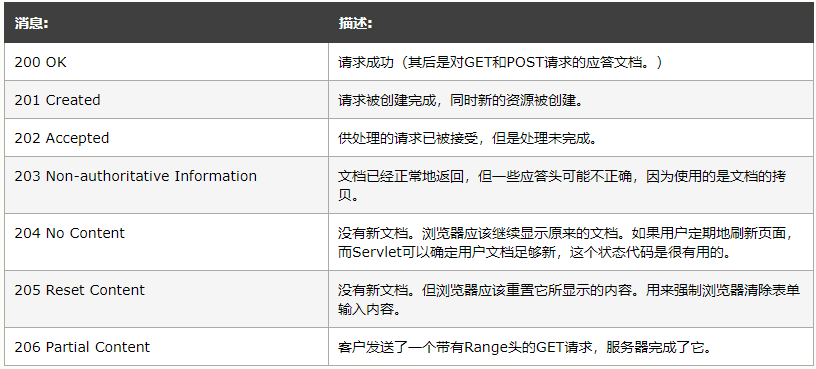
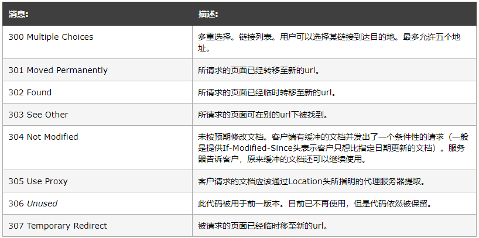
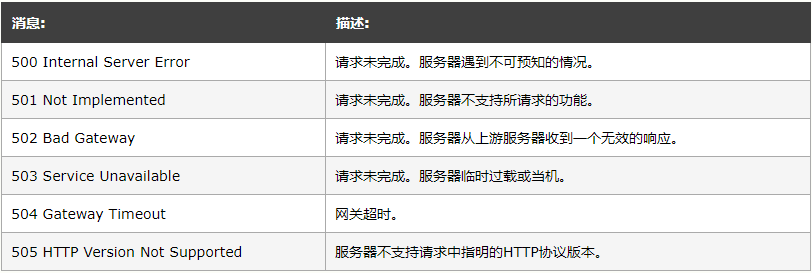
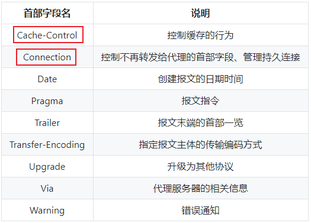
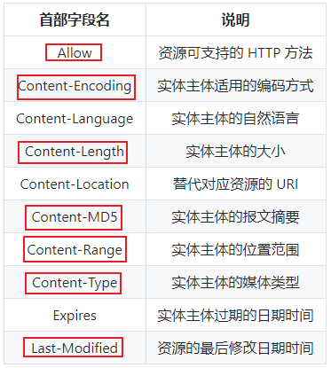

# TCP

* TCP状态转换图

  

* TCP流量控制和拥塞控制的实现？
  * 流量控制：TCP采用大小可变的滑动窗口进行流量控制。窗口大小的单位是字节，在TCP报文段首部的窗口字段写入的数值就是当前给对方设置的发送窗口数值的上限，发送窗口在连接建立时由双方商定。但在通信的过程中，**接收端可根据自己的资源情况，随时动态地调整对方的发送窗口上限值**

  * **拥塞控制**：**网络拥塞现象是指到达通信子网中某一部分的分组数量过多，使得该部分网络来不及处理，以致引起这部分乃至整个网络性能下降的现象**。严重时甚至会导致网络通信业务陷入停顿，即出现死锁现象。拥塞控制是处理网络拥塞现象的一种机制

    * 方法：有一个叫**慢启动门限** `ssthresh` （slow start threshold）状态变量，一般来说 `ssthresh` 的大小是 `65535` 字节

      * 慢开始( slow-start )：当 `cwnd` < `ssthresh` 时，使用慢启动算法，每当收到一个 ACK 时，指数级增长`cwnd`，如1，2，4，8...
      * 拥塞避免( congestion avoidance )：当 `cwnd` >= `ssthresh` 时，就会使用拥塞避免算法，线性增长`cwnd`，每当收到一个 ACK 时，`cwnd` 增加 `1/cwnd`。一直增长着，网络就会慢慢进入了拥塞的状况了，于是就会**出现丢包现象**，这时就需要对丢失的数据包进行重传。当触发了重传机制，也就进入了「拥塞发生算法」
      * 超时重传：`ssthresh` 设为 `cwnd/2` ，`cwnd` 重置为 1，重新开始慢开始算法
      * 快重传( fast retransmit )：当接收方发现丢了一个中间包的时候，**发送三次前一个包的 ACK**，于是**发送端就会快速地重传**，不必等待超时再重传。**TCP 认为这种情况不严重，因为大部分没丢**，只丢了一小部分，则 `ssthresh` 和 `cwnd` 变化如下：`cwnd` = `cwnd/2` ，也就是设置为原来的一半；`ssthresh` = `cwnd `；**进入快速恢复算法**
      * 快恢复( fast recovery )：拥塞窗口 `cwnd` = `ssthresh` + 3（ 3 的意思是确认有 3 个数据包被收到了）
        * 重传丢失的数据包
        * 如果再收到重复的 ACK，那么` cwnd` 增加 1
        * 如果收到新数据的 ACK 后，把 `cwnd `设置为第一步中的 `ssthresh `的值，原因是该 ACK 确认了新的数据，说明从 duplicated ACK 时的数据都已收到，该恢复过程已经结束，可以回到恢复之前的状态了，也即**再次进入拥塞避免状态**

      

      

      

* TCP重传机制
  * 滑动窗口机制，确立收发的边界，能让发送方知道**已经发送了多少、尚未确认的字节数、尚待发送的字节数**；**让接收方知道已经确认收到的字节数**
  * 选择性重传，用于对传输出错的序列进行重传

* **三次握手过程**
  
  * 主动建立连接方A的TCP向主机B发出连接请求报文段，其首部中的`SYN`(同步)标志位应置为1，表示想与目标主机B进行通信，并发送一个同步序列号`x`进行同步，**表明在后面传送数据时的第一个数据字节的序号**是`x + 1`。`SYN`同步报文会指明客户端使用的端口以及TCP连接的初始序号，A进入`SYN_SENT`状态
  * 接收连接方B的TCP收到连接请求报文段后，如同意则发回确认。在确认报中应将`ACK`位和`SYN`位置1，表示客户端的请求被接受。确认号应为`x + 1`，同时也为自己选择一个序号`y`，B进入`SYN_RCVD`状态
  * 主动方A的TCP收到目标主机B的确认后要向目标主机B给出确认，其`ACK`置1，确认号为`y +1`，而自己的序号为`x + 1`，A进入`ESTABLISHED状态`，B收到报文后也进入`ESTABLISHED`状态
  
* **四次挥手过程**
  
  * 主动关闭主机A的应用进程先向其TCP发出连接释放请求，并且不再发送数据。TCP通知对方要释放从A到B这个方向的连接，将发往主机B的TCP报文段首部的终止比特`FIN`置1，**其序号x等于前面已传送过的数据的最后一个字节的序号加1**
  * 被动关闭主机B的TCP收到释放连接通知后即发出确认，其序号为`y`，**确认号为`x + 1`**，同时通知高层应用进程，这样，从A到B的连接就释放了，**连接处于半关闭状态**。但**若主机B还有一些数据要发送主机A，则可以继续发送**。主机A只要正确收到数据，仍应向主机B发送确认
  * **若主机B不再向主机A发送数据，其应用进程就通知TCP释放连接**。主机B发出的连接释放报文段必须**将终止位`FIN`和确认位`ACK`置1**，**并使其序号仍为`y`，但还必须重复上次已发送过的`ACK` = `x + 1`**
  * **主机A必须对此发出确认，将`ACK`置1，`ACK `= `y + 1`，而自己的序号是`x + 1`**。这样才把从B到A的反方向的连接释放掉。主机A的TCP再向其应用进程报告，整个连接已经全部释放
  
* 为什么要三次握手？两次不行吗？
  * 三次握手的目的是**建立可靠的通信信道**，说到通讯，简单来说就是数据的发送与接收，而**三次握手最主要的目的就是双方确认自己与对方的发送与接收是正常的**
  * **经典场景**：客户端发送了第一个请求连接并且没有丢失，只是因为在**网络结点中滞留的时间太长**了
    - 由于TCP的客户端迟迟没有收到确认报文，以为服务器没有收到，此时**重新向服务器发送这条报文**，此后客户端和服务器经过两次握手完成连接，传输数据，然后关闭连接
    - 此时此前滞留的那一次请求连接，网络通畅了到达服务器，**这个报文本该是失效的**，但是，**两次握手的机制将会让客户端和服务器再次建立连接，这将导致不必要的错误和资源的浪费**
    - **如果采用的是三次握手，就算是那一次失效的报文传送过来了，服务端接受到了那条失效报文并且回复了确认报文，但是客户端不会再次发出确认。由于服务器收不到确认，就知道客户端并没有请求连接**
  * **避免资源浪费**
      * 如果客户端的 `SYN` 阻塞了，**重复发送多次** `SYN` 报文，那么服务器在**收到请求后就会建立多个冗余的无效链接，造成不必要的资源浪费**
  
* **TCP三次握手中，最后一次回复丢失，会发生什么**？
  
  * 如果最后一次ACK在网络中丢失，那么**Server端（服务端）该TCP连接的状态仍为SYN_RECV**，并且**根据 TCP的超时重传机制依次等待3秒、6秒、12秒后重新发送 SYN+ACK 包**，以便 **Client(客户端)重新发送ACK包** 
  * **如果重发指定次数后，仍然未收到ACK应答**，那么一段时间后，**Server（服务端）自动关闭这个连接** 。**当失败时服务器并不会重传ACK报文，而是直接发送RTS报文段，进入CLOSED状态。这样做的目的是为了`防止SYN洪泛攻击`**
  * **但是Client（客户端）认为这个连接已经建立**，如果Client（客户端]）端向Server（服务端）发送数据，**Server端（服务端）将以RST包（Reset，标示复位，用于异常的关闭连接）响应**，此时，**客户端知道第三次握手失败**
  
* **TCP是如何保证可靠传输的**？
  
  * **三次握手建立连接**（标志位）：通信前确认通信实体存在，并且双方可以正确发送和接收对方的信息
  * **序号机制**（序号、确认号）：确保了数据是按序、完整到达
  * **数据校验**（校验和）：**CRC校验全部数据，保证数据完整性和正确性**
  * **超时重传**（定时器）：保证因链路故障未能到达数据能够被多次重发
  * **窗口机制**（窗口）：提供**流量控制**，避免过量发送
  * **拥塞控制**：使用拥塞窗口机制，控制发送窗口大小，减少网络拥塞，避免因网络拥塞导致频繁丢包
  
* 为什么TCP挥手每两次中间有一个 **FIN-WAIT2等待时间**？

  * 主动关闭的一端调用完close以后（即发FIN给被动关闭的一端， 并且收到其对FIN的确认ACK）则进入FIN_WAIT_2状态。**如果这个时候因为网络突然断掉、被动关闭的一段宕机等原因，导致主动关闭的一端不能收到被动关闭的一端发来的FIN（防止对端不发送关闭连接的FIN包给本端）**，这个时候就需要FIN_WAIT_2定时器， **如果在该定时器超时的时候，还是没收到被动关闭一端发来的FIN，那么直接释放这个链接，进入CLOSE状态**

* 为什么客户端最后还要等待**2MSL**？/为什么还有个**TIME-WAIT**的时间等待？
  * **保证客户端发送的最后一个ACK报文能够到达服务器**，因为这个ACK报文可能丢失，服务器已经发送了FIN+ACK报文，请求断开，客户端却没有回应，于是服务器又会重新发送一次，而客户端就能在这个2MSL时间段内收到这个重传的报文，接着给出回应报文，并且会重启2MSL计时器 
  * 防止类似与“三次握手”中提到了的“已经失效的连接请求报文段”出现在本连接中。客户端发送完最后一个确认报文后，在这个2MSL时间中，就可以**使本连接持续的时间内所产生的所有报文段(被动关闭方延时到来的FIN报文)都从网络中消失(指的是在路由器的缓存失效)，这样新的连接中不会出现旧连接的请求报文**
  * 2MSL，**最大报文生存时间**，linux中，一个MSL 30 秒，2MSL = 60s

* TIME-WAIT 状态过多会产生什么后果？怎样处理？
  
  * 在高并发短连接的TCP服务器上，当服务器处理完请求后主动请求关闭连接，这样服务器上会有大量的连接处于TIME_WAIT状态，**服务器维护每一个连接需要一个socket，也就是每个连接会占用一个文件描述符，而文件描述符的使用是有上限的，如果持续高并发，会导致一些连接失败**
  * 作为服务器，短时间内关闭了大量的Client连接，就会造成服务器上出现大量的TIME_WAIT连接，**占据大量的fd，严重消耗着服务器的资源**，此时部分客户端就会显示连接不上
  * 作为客户端，短时间内大量的短连接，会大量消耗的Client机器的端口，毕竟端口只有65535个，端口被耗尽了，后续就无法在发起新的连接了 
  * **解决方法**：  
    * **用负载均衡来抗这些高并发的短请求** 
    * **可以通过修改`/etc/sysctl.conf`配置文件中`TIME_WAIT`时间来减少此情况**
    * 服务器可以设置 **SO_REUSEADDR 套接字选项来重用 TIME_WAIT状态端口**，TIME_WAIT 状态可以通过优化服务器参数得到解决，**因为发生TIME_WAIT的情况是服务器自己可控的，要么就是对方连接的异常，要么就是自己没有迅速回收资源，总之不是由于自己程序错误导致的** 
    * **利用SO_LINGER选项(设置 l_onoff为1，l_linger为0)的强制关闭方式，发送 RST 包越过TIMEWAIT状态，直接进入CLOSED状态**
    * 修改内核参数
      * 修改`/etc/sysctl.conf`，`net.ipv4.tcp_max_tw_buckets`对应的是**系统同时保持的TIME_WAIT的最大数量**，**超过此数量时，系统会立即清理出多余的TIME_WAIT连接**，系统日志中会出现TCP: time wait bucket table overflow的警告信息，最终该状态连接不会超出设置的值
      * `net.ipv4.tcp_max_tw_buckets`可设置的最大值为`262144` （硬件限制）这种方法虽然可以很快把TIME_WAIT状态数量降低至设定值以下，使用短连接连接方式的高并发状态下，TIME_WAIT产生速度非常快，当TIME_WAIT连接数达到设置值之后系统会以其产生速度相同的速度去销毁正常的TIME_WAIT连接，这时就可能出现前面说过的跳过TIME_WAIT连接状态可能会出现的结果，部分连接异常或者新的连接建立失败
      * `net.ipv4.tcp_max_tw_buckets`的值应该依据官方建议，不宜设置过小
    * 启用快速回收
      * 快速回收机制是系统对tcp连接通过一种方式进行快速回收的机制，对应内核参数中的`net.ipv4.tcp_tw_recycle`
      * **当timestamp和tw_recycle两个选项同时开启的情况下，开启per-host的PAWS机制。从而能快速回收处于TIME-WAIT状态的TCP流**
    * 开启重用机制
      * 开启重用用机制`net.ipv4.tcp_tw_reuse`，允许将TIME-WAIT sockets重新用于新的TCP连接，默认为0，表示关闭
  
      * **要开启重用机制需要依赖tcp_timestamps的功能，重用TIME_WAIT的条件是收到最后一个包后超过1s**
      * 优点：**配合tcp_timestamps可以在协议上安全的前提下对TIME_WAIT连接用于新的TCP连接，1s相比默认的60s时间还是极大的缩短了**

      * 缺点：**该机制只对“客户端”有效，即主动发起连接的一方**。比如一台web服务器，客户端发来请求时，web服务器时服务端，但web服务器又需要去连接后台数据库，这时候，web服务器又同时作为了客户端，只有主动发起连接一方主动断开所产生的TIME_WAIT该参数才生效
  
* CLOSE-WAIT状态过多原因后果及解决办法？
  * 原因及后果：close_wait状态出现的原因是**被动关闭方未关闭socket造成**，可能会产生“Too many open files”的fd用尽错误
  * 解决办法：
    * 设置定时器关闭超时无响应的socket连接，`read/recv`返回0，或者客户端连接socket发生`EPOLLRDHUP`事件时，关闭socket
    * 修改`/proc/sys/fs/file-max` 增大整个系统可以打开的文件数的限制
    * 修改`/etc/sysctl.conf`或`/proc/sys/net/ipv4/tcp_keepalive_time`，将keepalive的时间调小

* TCP收到RST包的几种情况
  
  * **访问不存在的端口**
    * **试图与不被监听的端口建立连接，则直接返回RST**，同时RST报文接收通告窗口大小为0
    * 客户端向服务器的某个端口发起连接，如果端口被**处于TIME_WAIT 状态的连接占用时**，客户端也会收到RST
  * **异常终止连接**
    * 一方直接发送RST报文，表示异常终止连接。**一旦发送方发送复位报文段，发送端所有排队等待发送的数据都被丢弃**。应用程序可以通过socket选项`SO_LINGER`(设置 `l_onoff`为1，`l_linger`为0)来发送RST复位报文
  * **处理半打开连接**(**如果一方已经关闭或异常终止连接而另一方却还不知道，我们将这样的 TCP 连接称为半打开**（Half-Open）)
      * 如A与B通信，**A关闭了连接，B却没有收到结束报文**（如网络故障），此时**B还维持着原来的连接**。而A即使重启，也没有该连接的任何信息。**这种状态就叫做半打开连接**。而此时**B往处于半打开状态的连接写数据，则对方回应RST复位报文**
  
* 心跳包机制
  
  * 心跳包之所以叫心跳包是因为：它**像心跳一样每隔固定时间发一次，以此来告诉服务器，这个客户端还活着**。事实上这是为了保持长连接，至于这个包的内容，是没有什么特别规定的，不过一般都是很小的包，或者只包含包头的一个空包。也有的心跳包中会携带一些需要定期更新的信息
  * 在TCP的机制里面，**本身是存在有心跳包的机制的**，也就是TCP的选项：SO_KEEPALIVE。**系统默认是设置的2小时的心跳频率**。但是它**检查不到机器断电、网线拔出、防火墙这些断线**。而且逻辑层处理断线可能也不是那么好处理，而且这个**时间间隔默认太长**。另外，**SO_KEEPALIVE一旦设置会对系统所有的socket产生影响，可能会浪费大量流量**
  * **心跳包一般来说都是在逻辑层发送空的echo包来实现的**。*下一个定时器，在一定时间间隔下发送一个空包给客户端，然后客户端反馈一个同样的空包回来，服务器如果在一定时间内收不到客户端发送过来的反馈包，那就只有认定说掉线了*
  * 其实，要判定掉线，**只需要send或者recv一下，如果结果为零，则为掉线**。但是，**在长连接下，有可能很长一段时间都没有数据往来**。理论上说，这个连接是一直保持连接的，但是实际情况中，如果中间节点出现什么故障是难以知道的。**更要命的是，有的节点（防火墙）会自动把一定时间之内没有数据交互的连接给断掉**。在这个时候，就需要我们的心跳包了，**用于维持长连接，保活**
  * 心跳包实现思路
  * 客户端连接上服务端以后，服务端维护一个**在线用户字典**，**客户端每隔一段时间，向服务器发送一个心跳包，服务器接收到包以后，字典数据的值都会更新为0**；**一旦服务端超过规定时间没有接收到客户端发来的包，字典数据将会递增加一，当字典数据的值累计大于等于三，则视为掉线**
  
* **TCP keep-alive和http keep-alive的区别**

  * **http Keep-Alive模式**：
    * Http协议采用“请求-应答”模式，当使用普通模式，即非Keep-Alive模式时，每个请求/应答，客户端和服务器都要新建一个连接，完成之后立即断开连接；当使用Keep-Alive模式时，Keep-Alive功能使客户端到服务器端的连接持续有效，当出现对服务器的后继请求时，Keep-Alive功能避免了建立或者重新建立连接
      
    * http1.0中默认是关闭的，需要在http头加入”Connection: Keep-Alive”，才能启用Keep-Alive
      
    * http 1.1中默认启用Keep-Alive，如果加入”Connection: close “才关闭。目前大部分浏览器都是用http1.1协议，也就是说默认都会发起Keep-Alive的连接请求了，所以是否能完成一个完整的Keep- Alive连接就看服务器设置情况
      
    * 优点：Keep-Alive模式更加高效，因为避免了连接建立和释放的开销
      
    * 缺点：长时间的Tcp连接容易导致系统资源无效占用，浪费系统资源

    * Keep-Alive timeout
        * Httpd守护进程，一般都提供了keep-alive timeout时间设置参数。比如nginx的keepalive_timeout，和Apache的KeepAliveTimeout。这个keepalive_timout时间值意味着：**一个http产生的tcp连接在传送完最后一个响应后，还需要hold住keepalive_timeout秒后，才开始关闭这个连接**
        * 当httpd守护进程发送完一个响应后，理应马上主动关闭相应的tcp连接，设置 keepalive_timeout后，httpd守护进程会想说：”再等等吧，看看浏览器还有没有请求过来”，这一等，便是keepalive_timeout时间。**如果守护进程在这个等待的时间里，一直没有收到浏览器发过来http请求，则关闭这个http连接**
    
  * **Tcp的Keepalive**
    
    * 连接建立之后，如果客户端一直不发送数据，或者隔很长时间才发送一次数据，当连接很久没有数据报文传输时如何去确定对方还在线，到底是掉线了还是确实没有数据传输，连接还需不需要保持，这种情况在TCP协议设计中是需要考虑到的
    * TCP协议通过一种巧妙的方式去解决这个问题，**当超过一段时间之后，TCP自动发送一个数据为空的报文（侦测包）给对方，如果对方回应了这个报文，说明对方还在线，连接可以继续保持，如果对方没有报文返回，并且重试了多次之后则认为链接丢失，没有必要保持连接**
    * tcp keep-alive是TCP的一种检测TCP连接状况的保鲜机制。tcp keep-alive保鲜定时器，支持三个系统内核配置参数：
      * net.ipv4.tcp_keepalive_intvl = 15
      * net.ipv4.tcp_keepalive_probes = 5
      * net.ipv4.tcp_keepalive_time = 7200
    * keepalive是TCP保鲜定时器，当网络两端建立了TCP连接之后，闲置（双方没有任何数据流发送往来）了tcp_keepalive_time后，服务器就会尝试向客户端发送侦测包，来判断TCP连接状况(有可能客户端崩溃、强制关闭了应用、主机不可达等等)
    * 如果没有收到对方的回答(ack包)，则会在tcp_keepalive_intvl后再次尝试发送侦测包，直到收到对方的ack,如果一直没有收到对方的ack,一共会尝试 tcp_keepalive_probes次，每次的间隔时间在这里分别是15s, 30s, 45s, 60s, 75s。如果尝试tcp_keepalive_probes,依然没有收到对方的ack包，则会丢弃该TCP连接。TCP连接默认闲置时间是2小时，一般设置为30分钟足够了

* **当保持长连接时，如何判断一次请求已经完成？**

  * Content-Length：表示实体内容的长度。浏览器通过这个字段来判断当前请求的数据是否已经全部接收。所以，当浏览器请求的是一个静态资源时，即服务器能明确知道返回内容的长度时，可以设置Content-Length来控制请求的结束。**但当服务器并不知道请求结果的长度时，如一个动态的页面或者数据，Content-Length就无法解决上面的问题，这个时候就需要用到Transfer-Encoding字段**
  * Transfer-Encoding：**指传输编码**，在上面的问题中，当服务端无法知道实体内容的长度时，就可以通过指定Transfer-Encoding: chunked来告知浏览器当前的编码是将数据分成一块一块传递的。当然, 还可以指定`Transfer-Encoding: gzip, chunked`表明实体内容不仅是gzip压缩的，还是分块传递的。最后，**当浏览器接收到一个长度为0的chunked时**， 知道当前请求内容已全部接收

* [**TCP性能调优**](https://zhuanlan.zhihu.com/p/170582219?utm_source=wechat_session)

* 什么是粘包现象？

  * 粘包是TCP特有现象，UDP是不存在粘包一说。TCP是面向字节流传输的，发送方引起的粘包是由TCP协议本身造成的，TCP为提高传输效率，发送方往往要收集到足够多的数据后才发送一个TCP段。若连续几次需要send的数据都很少，通常TCP会根据块的合并优化算法(Nagle)把这些数据合成一个TCP段后一次发送出去，这样接收方就收到了粘包数据。对于ssh等需要实时通信的应用，可以设置SO_NODELAY，使小包也能马上发出
  * UDP是无连接的，面向消息的，提供高效率服务。不会使用块的合并优化算法, 由于UDP支持的是一对多的模式，所以接收端的**skbuff**(套接字缓冲区）采用了链式结构来记录每一个到达的UDP包，在每个UDP包中就有了消息头（消息来源地址，端口等信息），这样，对于接收端来说，就容易进行区分处理了。 **即面向消息的通信是有消息保护边界的**

* 粘包发生场景
  * 第一种：发送端需要**等缓冲区满才发送出去**，造成粘包（发送数据时间间隔很短，**数据了很小，会合到一起，产生粘包**）
  * 第二种：接收方**不及时接收缓冲区的包**，造成多个包接收（客户端发送了一段数据，服务端只收了一小部分，服务端下次再收的时候还是从缓冲区拿上次遗留的数据，产生粘包）

* 粘包解决方法
  * 粘包问题的根源在于，**接收端不知道发送端将要传送的字节流的长度**，所以解决粘包的方法就是围绕，**如何让发送端在发送数据前，把自己将要发送的字节流总大小让接收端知晓，然后接收端来一个死循环接收完所有数据**
  * 设计一个报头模块(可以是struct结构体)，该模块的作用就是记录要发送的真实数据的详细信息(如数据长度等)
  * 发送时，先发报头长度，再编码报头内容然后发送，最后发真实数据内容
  * 接收时，先收报头长度，根据取出的长度收取报头内容，然后解码，从解码的结果中取出待取数据的详细信息，然后去取真实的数据内容
  * https://www.zhihu.com/question/20210025/answer/1982654161
  
* SYN洪泛攻击(SYN Flood，半开放攻击)，怎么解决？
  * SYN Flood利用TCP协议缺陷，**发送大量伪造的TCP连接请求，常用假冒的IP或IP号段发来海量的请求连接的第一个握手包（SYN包）**，被攻击服务器回应第二个握手包（SYN+ACK包），**因为对方是假冒IP，对方永远收不到包且不会回应第三个握手包**。**导致被攻击服务器保持大量SYN_RECV状态的“半连接”**，并且会**重试默认5次**回应第二个握手包，**大量随机的恶意syn占满了未完成连接队列，导致正常合法的syn排不上队列，让正常的业务请求连接不进来**(服务器端的资源分配是在二次握手时分配的，而客户端的资源是在完成三次握手时分配的，所以服务器容易受到SYN洪泛攻击)
  * 检测：检测 SYN 攻击非常的方便，**当你在服务器上看到大量的半连接状态时，特别是源IP地址是随机的，基本上可以断定这是一次SYN攻击**(在 Linux/Unix 上可以使用系统自带的 netstat 命令来检测 SYN 攻击)
  * 解决：
    * 缩短超时（SYN Timeout）时间，减少重传次数
    * 增加最大半连接数(扩大syn队列)
    * 过滤网关防护
    * **SYN cookies技术**：
      * **当服务器接受到 SYN 报文段时，不直接为该 TCP 分配资源**，而只是打开一个半开的套接字。接着会使用 SYN 报文段的源 Id，目的 Id，端口号以及只有服务器自己知道的一个秘密函数**生成一个 cookie，并把 cookie 作为序列号响应给客户端**
      * **如果客户端是正常建立连接，将会返回一个确认字段为 cookie + 1 的报文段**。接下来服务器会根据确认报文的源 Id，目的 Id，端口号以及秘密函数计算出一个结果，**如果结果的值 + 1 等于确认字段的值，则证明是刚刚请求连接的客户端，这时候才为该 TCP 分配资源**
    * 负载均衡，cdn，反向代理服务器
  
* TCP和UDP是否可以绑定同一端口进行通信?

  * 网络中可以被命名和寻址的通信端口，是操作系统可分配的一种资源
  * 按照OSI七层协议的描述，传输层与网络层在功能上的最大区别是传输层提供进程通信能力。从这个意义上讲，网络通信的最终地址就不仅仅是主机地址了，还包括可以描述进程的某种标识符。为此，TCP/IP协议提出了协议端口（protocol  port，简称端口）的概念，用于标识通信的进程
  * **端口是一种抽象的软件结构（包括一些数据结构和I/O缓冲区）**。应用程序（即进程）通过系统调用与某端口建立连接（binding）后，传输层传给该端口的数据都被相应进程所接收，相应进程发给传输层的数据都通过该端口输出。**在TCP/IP协议的实现中，端口操作类似于一般的I/O操作，进程获取一个端口，相当于获取本地唯一的I/O文件，可以用一般的读写原语访问之**
  * **类似于文件描述符，每个端口都拥有一个叫端口号（port  number）的整数型标识符，用于区别不同端口**。**由于TCP/IP传输层的两个协议TCP和UDP是完全独立的两个软件模块，因此各自的端口号也相互独立，如TCP有一个255号端口，UDP也可以有一个255号端口，二者并不冲突**
  * 端口号的分配是一个重要问题。**有两种基本分配方式**：
    * 第一种叫全局分配，这是一种集中控制方式，由一个公认的中央机构根据用户需要进行统一分配，并将结果公布于众
    * 第二种是本地分配，又称动态连接，即进程需要访问传输层服务时，向本地操作系统提出申请，操作系统返回一个本地唯一的端口号，进程再通过合适的系统调用将自己与该端口号联系起来（绑扎）
  * TCP/IP端口号的分配中综合了上述两种方式。TCP/IP将端口号分为两部分，少量的作为保留端口，以全局方式分配给服务进程。因此，每一个标准服务器都拥有一个全局公认的端口（即周知口，well-known  port），即使在不同机器上，其端口号也相同。剩余的为自由端口，以本地方式进行分配。TCP和UDP均规定，小于256的端口号才能作保留端口

* TCP和UDP的区别及适用场景

  * 区别
    * **是否面向连接**
      * TCP是面向连接的，即发送数据前需要与目标主机建立连接
      * UDP面向无连接的，发送数据前不需要建立连接
    * 服务对象
      * TCP 是**一对一**的两点服务，即一条连接只有两个端点
      * UDP 支持**一对一、一对多、多对多的交互通信**
    * 传输方式
      * TCP 是**流式传输**，没有边界，但保证顺序和可靠
      * UDP 是一个包一个包的发送，是有边界的，但可能会丢包和乱序
    * **是否提供可靠交付**
      * TCP在传输数据之前，需要三次握手来建立连接，并且通过**数据校验、拥塞控制、重传控制、滑动窗口和确认应答**等机制来**实现可靠交付**。数据传输过程中，数据无丢失，无重复，无乱序
      * UDP**不提供可靠交付**，只有通过检验和去丢弃那些不完整的报文，尽最大努力来保证交付的可靠性
    * **分片不同**
      * TCP 的数据大小如果大于 MSS 大小，则会**在传输层进行分片**，目标主机收到后，也同样**在传输层组装 TCP 数据包**，如果中途丢失了一个分片，只需要传输丢失的这个分片
      * UDP 的数据大小如果大于 MTU 大小，则会**在 IP 层进行分片**，目标主机收到后，在 **IP 层组装完数据，接着再传给传输层**，但是**如果中途丢了一个分片，则就需要重传所有的数据包，这样传输效率非常差，所以通常 UDP 的报文应该小于 MTU**
    * 首部开销
      * TCP 首部长度较长，会有一定的开销，首部在没有使用「选项」字段时是 20 个字节，如果使用了「选项」字段则会变长的
      * UDP 首部只有 8 个字节，并且是固定不变的，开销较小
    * **工作效率**
      * 前面提到TCP传输数据的控制非常多，这也导致了TCP网络开销大，工作效率相对低下，对系统的资源要求也比较高
      * UDP传输控制简单，因此工作效率相对高，对系统资源的要求偏低
    * **实时性**
      * TCP传输数据的控制程序较多，大幅度降低了数据传输的实时性
      * UDP协议简单，数据实时性较高
    * **安全性**
      * TCP传输机制多，容易被利用，例如DOS、DDOS攻击，因此在安全性上，不如UDP
      * UDP没有TCP这么多机制，被利用的机会就会少很多，但UDP不是绝对安全，也会被攻击
  * 适用场景
    * TCP
      * **对数据传输的质量有较高要求，但对实时性要求不高**。比如HTTP，HTTPS，FTP等传输文件的协议以及POP，SMTP等邮件传输的协议，应选用TCP协议
    * UDP
      * **只对数据传输的实时性要求较高，但不对传输质量有要求**。比如视频传输、实时通信等，应选用UDP协议

# UDP


#　IP

* IP协议在MAC帧中的协议号为`0x0800`

* IP首部

  

* **什么是IP分片**

  * IP协议在传输数据包时会将数据报文分成若干片进行传输，并在目标系统中进行重组。这以过程就成为分片

* **为什么要进行IP分片**

  * 如果IP数据报加上数据帧头部后大于MTU，数据报文就会分成若干片进行传输。那么什么是MTU呢？每一种物理网络都会规定链路层数据帧的最大长度，称为链路层MTU。**在以太网的环境中可传输的最大IP报文为1500字节**。如果要传输的数据帧的大小超过1500字节，即IP数据报的长度大于1472(1500-20-8=1472，UDP)字节，需要分片之后进行传输

* IP分片如何组装

  * 在IP头里面有16bit的**识别号唯一记录了一个IP包的ID**，以确定这几个分片是否属于同一个包，具有同一个ID的IP分片将会从新组装。**13bit的片偏移记录了一个IP分片相对于整个包的位置**。**3bit的标志位记录了该分片后面是否还有新的分片**。这三个分片组成了IP分片的所有的信息

# ICMP

* ICMP 全称是 Internet Control Message Protocol，也就是互联网控制报文协议，**其协议号为**`1`

* ICMP 主要的功能包括：

  * **确认 IP 包是否成功送达目标地址**
  * **报告发送过程中 IP 包被废弃的原因**和**改善网络设置**等

* 在 IP 通信中如果某个 IP 包因为某种原因未能达到目标地址，那么这个具体的原因将由 ICMP 负责通知

* ICMP 大致可以分为两大类：

  * 一类是**用于诊断**的查询消息，也就是「**查询报文类型**」
  * 另一类是**通知出错原因**的错误消息，也就是「**差错报文类型**」

  

* 查询报文类型

  * 回送消息 —— 类型 `0` 和` 8`

  * 回送消息用于进行通信的主机或路由器之间，**判断所发送的数据包是否已经成功到达对端的一种消息**，` ping` 命令就是利用这个消息实现的

  * 可以向对端主机**发送回送请求的消息**（ `ICMP Echo Request Message` ，类型` 8 `），也可以接收对端主机发回来的回送应答消息（ `ICMP Echo Reply Message` ，类型` 0` ）

    

* 差错报文类型

  * 目标不可达消息 —— 类型 为` 3`

    * IP 路由器无法将 IP 数据包发送给目标地址时，会给发送端主机返回一个目标不可达的 ICMP 消息，并在这个消息中显示不可达的具体原因，原因记录在 ICMP 包头的代码字段。由此，根据 ICMP 不可达的具体消息，发送端主机也就可以了解此次发送不可达的具体原因

    * 举例 6 种常见的目标不可达类型的代码：

      

    * 网络不可达

      * IP 地址是分为网络号和主机号的，所以当路由器中的路由器表匹配不到接收方 IP 的网络号，就通过ICMP 协议以网络不可达（ `Network Unreachable `）的原因告知主机

    * 主机不可达

      * 当路由表中没有该主机的信息，或者该主机没有连接到网络，那么会通过 ICMP 协议以主机不可达（ `Host Unreachable `）的原因告知主机

    * 协议不可达

      * 当主机使用 TCP 协议访问对端主机时，能找到对端的主机了，可是**对端主机的防火墙已经禁止 TCP 协议访问**，那么会通过 ICMP 协议以协议不可达的原因告知主机

    * 需要进行分片但设置了不分片位

      * 发送端主机发送 IP 数据报时，**将 IP 首部的分片禁止标志位设置为1** 。**根据这个标志位，途中的路由器遇到超过 MTU 大小的数据包时，不会进行分片，而是直接抛弃**

    * 端口不可达

      * 当主机访问对端主机 8080 端口时，这次能找到对端主机了，防火墙也没有限制，可是发现**对端主机没有进程监听 8080 端口**，那么会通过 ICMP 协议以端口不可达的原因告知主机

  * 原点抑制消息 —— 类型 `4`

    * 在使用低速广域线路的情况下，**连接 WAN 的路由器可能会遇到网络拥堵的问题**，`ICMP` 原点抑制消息的目的就是为了缓和这种拥堵情况
    * 当路由器向低速线路发送数据时，其发送队列的缓存变为零而无法发送出去时，可以向 IP 包的源地址发送一个 ICMP 原点抑制消息
    * 收到这个消息的主机借此了解在整个线路的某一处发生了拥堵的情况，从而**增大 IP 包的传输间隔，减少网络拥堵的情况**
    * 然而，**由于这种 ICMP 可能会引起不公平的网络通信，一般不被使用**

  * 重定向消息 —— 类型 `5`

    * 如果**路由器发现发送端主机使用了「不是最优」的路径发送数据，那么它会返回一个 ICMP 重定向消息给这个主机**
    * 在这个消息中包含了**最合适的路由信息和源数据**。这主要发生在路由器持有更好的路由信息的情况下
    * **路由器会通过这样的 ICMP 消息告知发送端，让它下次发给另外一个路由器**

  * 超时消息 —— 类型 `11`

    * IP 包中有一个字段叫做 `TTL` （ `Time To Live `，生存周期），它的值随着**每经过一次路由器就会减1，直到减到 0 时该 IP 包会被丢弃**
    * 此时，**路由器将会发送一个 ICMP 超时消息给发送端主机，并通知该包已被丢弃**
    * 设置 IP 包生存周期的主要目的，是为了在**路由控制遇到问题发生循环状况时，避免 IP 包无休止地在网络上被转发**

# ping

# traceroute

# ARP

# DNS

* **DNS占用53号端口，同时使用TCP和UDP协议**。那么DNS在什么情况下使用这两种协议？
  * DNS在区域传输的时候使用TCP协议，其他时候使用UDP协议
* **DNS区域传输的时候使用TCP协议**
  * 辅域名服务器会定时（一般3小时）向主域名服务器进行查询以便了解数据是否有变动。如有变动，会执行一次区域传送，进行数据同步。区域传送使用TCP而不是UDP，因为数据同步传送的数据量比一个请求应答的数据量要多得多
  * TCP是一种可靠连接，保证了数据的准确性
* **域名解析时使用UDP协议：**
  * 客户端向DNS服务器查询域名，一般返回的内容都不超过512字节，用UDP传输即可。**不用经过三次握手，这样DNS服务器负载更低，响应更快**。理论上说，客户端也可以指定向DNS服务器查询时用TCP，但事实上，很多DNS服务器进行配置的时候，仅支持UDP查询包

* **DNS劫持**
  * 域名劫持是互联网攻击的一种方式，通过**攻击域名解析服务器**，或**伪造域名解析服务器**的方法，**把目标网站域名解析到错误的IP地址**从而实现用户无法访问目标网站的目的或者蓄意或恶意要求用户访问指定IP地址（网站）的目的
  * 常见三种情况
    * **错误域名解析到纠错导航页面**，导航页面存在广告。判断方法：访问的域名是错误的，而且跳转的导航页面也是官方的，如电信的114，联通移网域名纠错导航页面
    * **错误域名解析到非正常页面**，对错误的域名解析到导航页的基础上，有一定几率解析到一些恶意站点，这些恶意站点通过判断你访问的目标HOST、URI、 referrer等来确定是否跳转广告页面，这种情况就有可能导致跳转广告页面（域名输错）或者访问页面被加广告（页面加载时有些元素的域名错误而触发）这种劫持会对用户访问的目标HOST、URI、 referrer等会进行判定来确定是否解析恶意站点地址，不易被发现
    * **直接将特点站点解析到恶意或者广告页面**，这种情况比较恶劣，而且出现这种情况未必就是运营商所为，家里路由器被黑，或者系统被入侵，甚至运营商的某些节点被第三方恶意控制都有可能

# NAT

## NAT穿透/UDP打洞

# [HTTP/HTTPS](https://www.nowcoder.com/discuss/613239?type=2&channel=-1&source_id=discuss_terminal_discuss_hot_nctrack)

* 什么是HTTP

  * **TPC/IP协议是传输层协议**，主要解决**数据如何在网络中传输**，而**HTTP是应用层协议**，主要解决**如何包装数据**
  * HTTP 是一种 超文本传输协议(Hypertext Transfer Protocol)

* Http 协议的内容

  * HTTP报文大致分为报文首部 + 报文主体**，**首部和报文主体由CRLF（一行空格）来区分
  * HTTP报文有**请求报文**和**响应报文**两种，HTTP的这两种报文都由三部分组成：开始行、首部行、实体主体
    - **开始行可用于区分两种报文** 
    - **首部行**都是由**首部字段名 和 值**组成，每个首部行在结束地方都有 CRLF 
    - 首部行和实体主体间有 CRLF 
  * **HTTP请求**由三部分组成，分别是：**请求行、消息报头、请求正文**
  * **HTTP响应**也是由三个部分组成，分别是：**状态行、消息报头、响应正文**
  * **Request Body 请求体****：**根据应用场景的不同，HTTP请求的请求体有三种不同的形式**。**
    * 请求体是任意类型的，服务器不会解析请求体，请求体的处理需要自己解析**，如 POST JSON 的时候就是这类。例如：**application/json，text/xml
    * 表单提交**：这里的格式要求就是 URL 中 Query String 的格式要求：多个键值对之间用&连接，键与值之间用=连接。****表单**的请求头中 `Content-type `默认"application/x-www-form-urlencoded " 对表单数据进行编码，数据以键值对在http请求体重发送给服务器；如果enctype 属性为"multipart/form-data"，则以消息的形式发送给服务器
    * 文件分割**：第三种请求体被分成多个部分，**文件上传时会被使用，这种格式最先是被用于邮件传输中，每个字段/文件都被 boundary（Content-Type中指定的）分成单独的段，每段以--加 boundary 开头，然后是该段的描述头，描述头之后空一行接内容，请求结束的标识为 boundary 后面加--；

* HTTP常见方法

  

  * GET

    * 获取资源：当前网络请求中，绝大部分使用的是 GET 方法

  * HEAD

    * 获取报文首部：和 GET 方法类似，但是**不返回报文实体主体部分**，主要**用于确认 URL 的有效性以及资源更新的日期时间**等

  * POST

    * 传输实体主体：POST 主要用来传输数据，而 GET 主要用来获取资源

  * PUT

    * 上传文件：由于自身不带验证机制，任何人都可以上传文件，因此存在安全性问题，一般不使用该方法

      ```http
      PUT /new.html HTTP/1.1
      Host: example.com
      Content-type: text/html
      Content-length: 16
      
      <p>New File</p>
      ```

  * PATCH

    * 对资源进行部分修改：**PUT 也可以用于修改资源，但是只能完全替代原始资源**，**PATCH 允许部分修改**

      ```http
      PATCH /file.txt HTTP/1.1
      Host: www.example.com
      Content-Type: application/example
      If-Match: "e0023aa4e"
      Content-Length: 100
      
      [description of changes]
      ```

  * DELETE

    * 删除文件：与 PUT 功能相反，并且同样不带验证机制

  * OPTIONS

    * 查询支持的方法：查询指定的 URL 能够支持的方法。会返回 `Allow: GET, POST, HEAD, OPTIONS` 这样的内容

  * CONNECT

    * 要求在与代理服务器通信时建立隧道：使用 SSL（Secure Sockets Layer，安全套接层）和 TLS（Transport Layer Security，传输层安全）协议把通信内容加密后经网络隧道传输

      ```http
      CONNECT www.example.com:443 HTTP/1.1
      ```

      

  * TRACE

    * 追踪路径：服务器会将通信路径返回给客户端。发送请求时，在 Max-Forwards 首部字段中填入数值，每经过一个服务器就会减 1，当数值为 0 时就停止传输。通常不会使用 TRACE，并且它容易受到 XST 攻击（Cross-Site Tracing，跨站追踪）

* GET和POST区别

  * 

* HTTP常见状态码

  * 1XX 信息

    
  * 2XX 成功

    
  * 3XX 重定向

    
  * 4XX 客户端错误

    
  * 5XX 服务器错误

    

* HTTP首部字段

  * HTTP通用首部字段

    

  * HTTP请求首部字段

    

  * HTTP响应首部字段

    

  *  HTTP实体首部字段

    

* **Cookie**

  * 概念

    * HTTP 协议是无状态的，主要是为了让 HTTP 协议尽可能简单，使得它能够处理大量事务。**HTTP/1.1 引入 Cookie 来保存状态信息**
    * **Cookie 是服务器发送到用户浏览器并保存在本地的一小块数据**，**它会在浏览器之后向同一服务器再次发起请求时被携带上，用于告知服务端两个请求是否来自同一浏览器。由于之后每次请求都会需要携带 Cookie 数据，因此会带来额外的性能开销**（尤其是在移动环境下）
    * Cookie 曾一度用于客户端数据的存储，因为当时并没有其它合适的存储办法而作为唯一的存储手段，但现在随着现代浏览器开始支持各种各样的存储方式，**Cookie 渐渐被淘汰**。新的浏览器 API 已经允许开发者直接将数据存储到本地，如使用 Web storage API（本地存储和会话存储）或 IndexedDB

  * 用途

    * 会话状态管理（如**用户登录状态、购物车、游戏分数或其它需要记录的信息**）
    * 个性化设置（如用户自定义设置、主题等）
    * 浏览器行为跟踪（如跟踪分析用户行为等）

  * 创建过程

    * **服务器发送的响应报文包含 Set-Cookie 首部字段，客户端得到响应报文后把 Cookie 内容保存到浏览器中**

      ```http
      HTTP/1.0 200 OK
      Content-type: text/html
      Set-Cookie: yummy_cookie=choco
      Set-Cookie: tasty_cookie=strawberry
      
      [page content]
      ```

    * 客户端之后对同一个服务器发送请求时，会从浏览器中取出 Cookie 信息并通过 Cookie 请求首部字段发送给服务器

      ```http
      GET /sample_page.html HTTP/1.1
      Host: www.example.org
      Cookie: yummy_cookie=choco; tasty_cookie=strawberry
      ```

  * 分类

    * **会话期 Cookie：浏览器关闭之后它会被自动删除，也就是说它仅在会话期内有效**

    * **持久性 Cookie：指定过期时间（Expires）或有效期（max-age）之后就成为了持久性的 Cookie**

      ```http
      Set-Cookie: id=a3fWa; Expires=Wed, 21 Oct 2015 07:28:00 GMT;
      ```

  * Secure

    * 标记为 Secure 的 Cookie **只能通过被 HTTPS 协议加密过的请求**发送给服务端。**但即便设置了 Secure 标记，敏感信息也不应该通过 Cookie 传输，因为 Cookie 有其固有的不安全性，Secure 标记也无法提供确实的安全保障**

* **Session**

  * 除了可以将用户信息通过 Cookie 存储在用户浏览器中，**也可以利用 Session 存储在服务器端，存储在服务器端的信息更加安全**
  * Session 可以存储在服务器上的文件、数据库或者内存中。**也可以将 Session 存储在 Redis 这种内存型数据库中**，效率会更高
  * 使用 Session **维护用户登录状态**的过程如下
    * 用户进行登录时，**用户提交包含用户名和密码的表单，放入 HTTP 请求报文中**
    * **服务器验证该用户名和密码，如果正确则把用户信息存储到 Redis 中，它在 Redis 中的 Key 称为 Session ID**
    * **服务器返回的响应报文的 Set-Cookie 首部字段包含了这个 Session ID，客户端收到响应报文之后将该 Cookie 值存入浏览器中**
    * **客户端之后对同一个服务器进行请求时会包含该 Cookie 值，服务器收到之后提取出 Session ID，从 Redis 中取出用户信息，继续之前的业务操作**
  * 应该注意 Session ID 的安全性问题，不能让它被恶意攻击者轻易获取，那么就不能产生一个容易被猜到的 Session ID 值。此外，还需要**经常重新生成 Session ID**。在对安全性要求极高的场景下，例如转账等操作，**除了使用 Session 管理用户状态之外，还需要对用户进行重新验证，比如重新输入密码，或者使用短信验证码等方式**

* **session和cookie的关系**

  * cookie只是实现session的其中一种方案。虽然是最常用的，但并不是唯一的方法。禁用cookie后还有其他方法存储，比如放在url中
  * 现在大多都是Session + Cookie，但是只用session不用cookie，或是只用cookie，不用session在理论上都可以保持会话状态。可是实际中因为多种原因，一般不会单独使用
  * 用session只需要在客户端保存一个id，**实际上大量数据都是保存在服务端**。如果全部用cookie，数据量大的时候客户端是没有那么多空间的。
  * 如果只用cookie不用session，**那么账户信息全部保存在客户端**，一旦被劫持，全部信息都会泄露。并且客户端数据量变大，网络传输的数据量也会变大

* **token**

  * token 也称作令牌，其认证方式类似于**临时的证书签名**, 并且是一种**服务端无状态的认证方式**
  * 组成
    * uid: 用户唯一身份标识
    * time: 当前时间的时间戳
    * sign: 签名, **使用 hash/encrypt 压缩成定长的十六进制字符串**，以防止第三方恶意拼接
    * 固定参数(可选): 将一些常用的固定参数加入到 token 中是为了避免重复查库
  * 存放位置：**token在客户端一般存放于local Storage，cookie，或session Storage中**。**在服务器一般存于数据库中**
  * token的认证过程（与cookie相似）
    * 用户登录，成功后服务器返回Token给客户端
    * 客户端收到数据后保存在客户端
    * 客户端再次访问服务器，将token放入headers中
    * 服务器端**采用filter过滤器校验**。校验成功则返回请求数据，校验失败则返回错误码
  * **token可以抵抗csrf，cookie+session不行**
    * 假如用户正在登陆银行网页，同时登陆了攻击者的网页，并且银行网页未对csrf攻击进行防护。攻击者就可以在网页放一个表单，该表单提交src为`http://www.bank.com/api/transfer`，body为`count=1000&to=Tom`。倘若是session+cookie，用户打开网页的时候就已经转给Tom1000元了。**因为form 发起的 POST 请求并不受到浏览器同源策略的限制**，**因此可以任意地使用其他域的 Cookie 向其他域发送 POST 请求，形成 CSRF 攻击**。在post请求的瞬间，cookie会被浏览器自动添加到请求头中。**但token不同，token是开发者为了防范csrf而特别设计的令牌，浏览器不会自动添加到headers里，攻击者也无法访问用户的token，所以提交的表单无法通过服务器过滤，也就无法形成攻击**

* 分布式情况下的session和token

  * 我们已经知道session是有状态的，一般存于服务器内存或硬盘中，**当服务器采用分布式或集群时**，session就会面对负载均衡问题
    - **负载均衡多服务器的情况，不好确认当前用户是否登录，因为多服务器不共享session**。这个问题也可以将session存在一个服务器中来解决，但是就不能完全达到负载均衡的效果。当今的几种[解决session负载均衡](http://blog.51cto.com/zhibeiwang/1965018)的方法
  * 而token是无状态的，token字符串里就保存了所有的用户信息
    * 客户端登陆传递信息给服务端，服务端收到后把**用户信息加密（token）传给客户端**，客户端将token存放于local Storage等容器中。客户端每次访问都传递token，服务端解密token，就知道这个用户是谁了。**通过cpu加解密，服务端就不需要存储session占用存储空间，就很好的解决负载均衡多服务器的问题了**。这个方法叫做JWT(Json Web Token）

* 总结

  * session存储于服务器，可以理解为一个状态列表，拥有一个唯一识别符号session Id，**通常存放于cookie中**。**服务器收到cookie后解析出session Id，再去session列表中查找，才能找到相应session**。依赖cookie
  * **cookie类似一个令牌，装有session Id，存储在客户端，浏览器通常会自动添加**
  * **token也类似一个令牌，无状态，用户信息都被加密到token中，服务器收到token后解密就可知道是哪个用户**。需要开发者手动添加
  * jwt只是一个跨域认证的方案