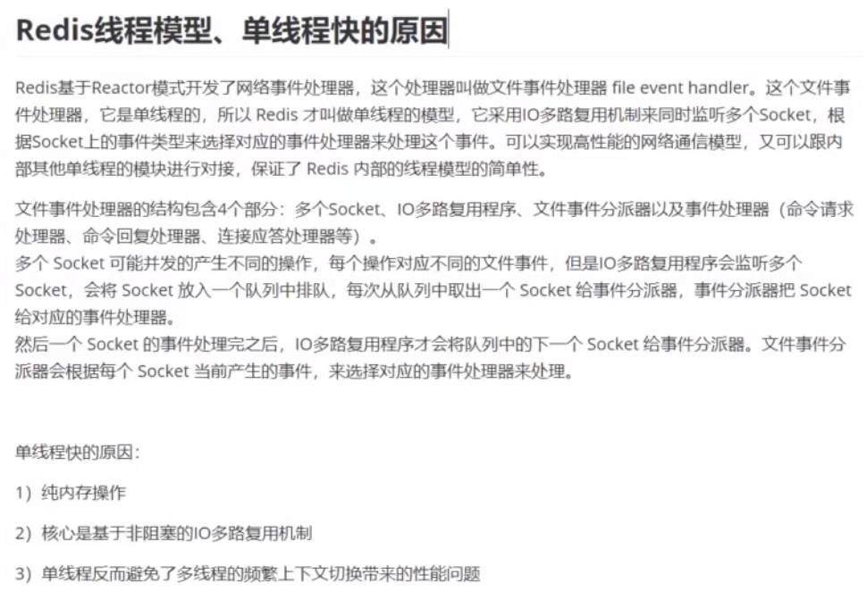

# linux/os

* linux查看各硬件资源的方法

  1. 显卡信息
     dmesg | grep -i vga
     lspci | grep -i vga //查看显卡信息

  2. 查看主板信息，查看主板的序列号

     dmidecode | grep -i 'serrial number' 

  3. CPU信息

  　　#通过/proc文件系统
  　　cat /proc/cpuinfo
  　　dmesg | grep -i cpu
  　　#通过查看开机信息
  　　dmidecode -t processor

  ​		# 实时监测多处理器系统上的**每个CPU的使用情况**

  ​		**mpstat** 

  4. 硬盘信息
     fdisk -l //分区情况
     df -h //大小情况
     du -h //使用情况
     dmesg | grep sda

  5. 内存信息
     cat /proc/meminfo
     dmesg | grep mem
     free -m
     vmstat
     dmldecode | grep -i mem

  6. 网卡信息

     dmesg | grep -i eth
     lspci | grep -i eth

     ifconfig

     #简单的网络流量监测工具

     **ifstat** 

  7. 鼠标键盘和USB信息
     cat /proc/bus/input/devices 查看键盘和鼠标
     cat /proc/bus/usb/devices 查看USB设备
     cat /proc/interrupts

  8. 声卡信息
     lspci | grep -i vga
     dmesg | grep -i vga

  9. 其他命令
     lspci (显示外设备信息，如USB，网卡等信息)

* linux的性能好坏评判有什么指标
  * https://www.cnblogs.com/zhoufankui/p/8372654.html

# sql

* limit优化

  * limit用于分页查询时越往后翻性能越差，解决的原则：缩小扫描范围 ，如下所示：
    select * from orders order by id desc limit 100000,10 

    耗时0.4秒

    select * from orders order by id desc limit 1000000,10

    耗时5.2秒

  * 先筛选出ID缩小查询范围，写法如下：
    select * from orders where id > (select id from orders order by id desc  limit 1000000, 1) order by id desc limit 0,10

    耗时0.5秒

  * 如果查询条件仅有主键ID，写法如下：
    select id from orders where id between 1000000 and 1000010 order by id desc

    耗时0.3秒
    如果以上方案依然很慢呢？只好用游标了，参考JDBC使用游标实现分页查询的方法

* 联合索引、最左前缀匹配

  * https://www.cnblogs.com/lanqi/p/10282279.html

* sql性能优化
  * https://www.cnblogs.com/hlkawa/p/12164961.html

# redis

* redis常问问题

  * https://mp.weixin.qq.com/s/MF07h90MRVc85vTGin5KFw
  
* redis为什么那么快？

  

* 怎么实现redis分布式锁
  * https://www.zhihu.com/question/300767410/answer/1931519430
* * 

# 秒杀系统设计

* 什么是秒杀
  * 通俗一点讲就是网络商家为促销等目的组织的网上限时抢购活动

* 业务特点
  * 高并发：秒杀的特点就是这样时间极短、 瞬间用户量大
  * 库存量少：一般秒杀活动商品量很少，这就导致了只有极少量用户能成功购买到
  * 业务简单：流程比较简单，一般都是下订单、扣库存、支付订单
  * 恶意请求，数据库压力大

* 解决方案
  * 前端：页面资源静态化，按钮控制，**使用答题校验码可以防止秒杀器的干扰**，让更多用户有机会抢到
  * nginx：校验恶意请求，转发请求，负载均衡；**动静分离**，不走tomcat获取静态资源，nginx处理静态资源，后台tomcat等容器处理动态资源；gzip压缩，减少静态文件传输的体积，节省带宽，提高渲染速度
  * 业务层：集群，多台机器处理，提高并发能力
  * redis：集群保证高可用，持久化数据；分布式锁（悲观锁）；缓存热点数据（库存）
  * mq：**削峰限流，MQ堆积订单，保护订单处理层的负载，Consumer根据自己的消费能力来取Task，实际上下游的压力就可控了。重点做好路由层和MQ的安全**
  * 数据库：读写分离，拆分事务提高并发度

* 秒杀系统设计小结
  * 秒杀系统就是一个“三高”系统，即高并发、高性能和高可用的分布式系统
  * 秒杀设计原则：前台请求尽量少，后台数据尽量少，调用链路尽量短，尽量不要有单点
  * 秒杀高并发方法：访问拦截、分流、动静分离
  * 秒杀数据方法：减库存策略、热点、异步、限流降级
  * 访问拦截主要思路：通过CDN和缓存技术，尽量把访问拦截在离用户更近的层，尽可能地过滤掉无效请求
  * 分流主要思路：通过分布式集群技术，多台机器处理，提高并发能力